# RISCV32-ChampionChip — Team 41

32-bit multicycle RISC-V processor (RV32I + Zmmul + Xicrc), designed in
ChipInventor and hardened with OpenLane on SkyWater 130 nm.

**ISA coverage 47/47 (100%)** · **Firmware validation: all stages PASSED**

```
pic/          block diagrams and simulation logs
rtl/          module sources
tb/           testbenches
synthesis/    OpenLane config and flattened source
firmware.hex  validation firmware
```

### Contents

[ALU](#alu) · [BranchComparator](#branchcomparator) · [Multiplier](#multiplier) ·
[CRC](#crc) · [ImmediateGenerator](#immediategenerator) ·
[MemoryUnit](#memoryunit) · [ProgramCounter](#programcounter) ·
[PC_Target_Align](#pc_target_align) · [RegisterFile](#registerfile) ·
[ControlUnit](#controlunit) · [Datapath registers](#datapath-registers) ·
[Multiplexers](#multiplexers)

---

## ALU


Eleven operations selected by a 4-bit code formed from `funct7[25]` and
`funct3[14:12]`. Two input multiplexers let one ALU serve register operations,
immediate operations and PC-relative address computation: `A_sel` picks
`reg_rs_1` or `pc_output`, `B_sel` picks `reg_rs_2` or `immediate`.

| Code | Op | | Code | Op |
|---|---|---|---|---|
| `0` | PASS_B (LUI) | | `6` | SLL |
| `1` | ADD | | `7` | SRL |
| `2` | SUB | | `8` | MRS (arithmetic `>>>`) |
| `3` | AND | | `9` | SLT (signed) |
| `4` | OR | | `A` | SLTU (`$unsigned`) |
| `5` | XOR | | | |

<details><summary><b>ALU.v</b></summary>

```verilog
//NOTE: ALU control signals
//funct7 [31:25] - lsb used
//funct3 [14:12] - all 3 used
//opcode [6:0] - fixed for R-type
//funct7[25] + funct3[14:12]


`define c_ALU_OP_PASS_B    4'h0
`define c_ALU_OP_ADD    4'h1
`define c_ALU_OP_SUB    4'h2
`define c_ALU_OP_AND    4'h3
`define c_ALU_OP_OR     4'h4
`define c_ALU_OP_XOR    4'h5
`define c_ALU_OP_SLL    4'h6
`define c_ALU_OP_SRL    4'h7
`define c_ALU_OP_MRS    4'h8
`define c_ALU_OP_SLT    4'h9
`define c_ALU_OP_SLTU    4'hA


module ALU(
    input wire [31:0] reg_rs_1,
    input wire [31:0] reg_rs_2,
    input wire [31:0] pc_output,
    input wire [31:0] immediate,
    input wire [3:0] ALU_control,
    input wire A_sel,
    input wire B_sel,
    output reg signed [31:0] Q
    );
    wire signed [31:0] A_Mux;


    wire signed [31:0] B_Mux;


    assign A_Mux = (A_sel) ? pc_output : reg_rs_1;
   
    assign B_Mux = (B_sel) ? immediate : reg_rs_2;


    always @ (*) begin
        case (ALU_control)
            `c_ALU_OP_PASS_B:    Q = B_Mux;
            `c_ALU_OP_ADD:    Q = A_Mux + B_Mux;
            `c_ALU_OP_SUB:    Q = A_Mux - B_Mux;
            `c_ALU_OP_AND:    Q = A_Mux & B_Mux;
            `c_ALU_OP_OR:     Q = A_Mux | B_Mux;
            `c_ALU_OP_XOR:    Q = A_Mux ^ B_Mux;
            `c_ALU_OP_SLL:    Q = A_Mux << B_Mux[4:0]; //B stores the shifting value
            `c_ALU_OP_SRL:    Q = A_Mux >> B_Mux[4:0];
            `c_ALU_OP_MRS:    Q = A_Mux >>> B_Mux[4:0]; // Performs arithmetic right shift properly since A_Mux is signed
            `c_ALU_OP_SLT:    Q = (A_Mux < B_Mux) ? 32'h1 : 32'h0;
            `c_ALU_OP_SLTU:   Q = ($unsigned(A_Mux) < $unsigned(B_Mux)) ? 32'h1 : 32'h0; // Explicitly cast to unsigned
            default:          Q = 32'h0; // Prevents unwanted latches  
        endcase
    end
endmodule

```

[Full source →](rtl/ALU.v)

</details>

### Testbench

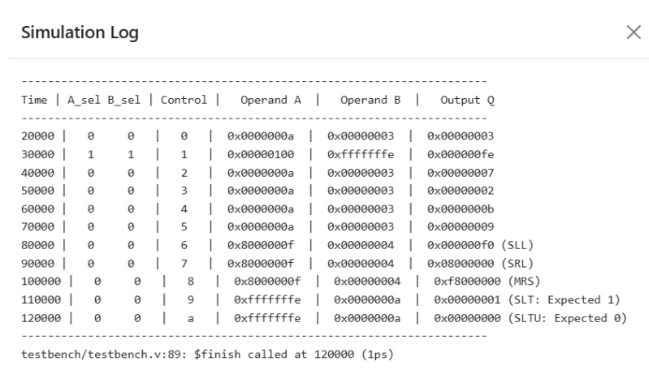

Drives all eleven operations and prints both multiplexer outputs alongside the
result. Directed operands isolate the sign-sensitive paths: `0x8000000F`
shifted right by 4 separates SRL (`0x08000000`) from MRS (`0xF8000000`), and
`-2` against `+10` separates SLT (returns 1) from SLTU (returns 0).

<details><summary><b>tb_ALU.v</b></summary>

```verilog
`timescale 1ns / 1ps


module testbench();


    // Inputs
    reg [31:0] reg_rs_1;
    reg [31:0] reg_rs_2;
    reg [31:0] pc_output;
    reg [31:0] immediate;
    reg [3:0]  ALU_control;
    reg        A_sel;
    reg        B_sel;


    // Output
    wire signed [31:0] Q;


    // Instantiate Unit Under Test (UUT)
    ALU uut (
        .reg_rs_1(reg_rs_1),
        .reg_rs_2(reg_rs_2),
        .pc_output(pc_output),
        .immediate(immediate),
        .ALU_control(ALU_control),
        .A_sel(A_sel),
        .B_sel(B_sel),
        .Q(Q)
    );


    initial begin
        // Display headers
        $display("----------------------------------------------------------------------");
        $display("Time | A_sel B_sel | Control |   Operand A  |   Operand B  |   Output Q   ");
        $display("----------------------------------------------------------------------");


        // Initialize inputs
        reg_rs_1    = 32'h0000_000A; // 10
        reg_rs_2    = 32'h0000_0003; // 3
        pc_output   = 32'h0000_0100; // 256
        immediate   = 32'hFFFF_FFFE; // -2 (signed) or 4294967294 (unsigned)
        A_sel       = 1'b0;
        B_sel       = 1'b0;
        ALU_control = 4'h0;


        #10;


        // Test 1: PASS_B (B_sel = 0 -> reg_rs_2)
        ALU_control = `c_ALU_OP_PASS_B; A_sel = 0; B_sel = 0; #10;
        $display("%4t |   %b     %b   |   %h   |  0x%h  |  0x%h  |  0x%h", $time, A_sel, B_sel, ALU_control, uut.A_Mux, uut.B_Mux, Q);


        // Test 2: ADD (A_sel = 1 -> pc_output, B_sel = 1 -> immediate)
        ALU_control = `c_ALU_OP_ADD; A_sel = 1; B_sel = 1; #10;
        $display("%4t |   %b     %b   |   %h   |  0x%h  |  0x%h  |  0x%h", $time, A_sel, B_sel, ALU_control, uut.A_Mux, uut.B_Mux, Q);


        // Test 3: SUB
        ALU_control = `c_ALU_OP_SUB; A_sel = 0; B_sel = 0; #10;
        $display("%4t |   %b     %b   |   %h   |  0x%h  |  0x%h  |  0x%h", $time, A_sel, B_sel, ALU_control, uut.A_Mux, uut.B_Mux, Q);


        // Test 4: AND, OR, XOR
        ALU_control = `c_ALU_OP_AND; #10;
        $display("%4t |   %b     %b   |   %h   |  0x%h  |  0x%h  |  0x%h", $time, A_sel, B_sel, ALU_control, uut.A_Mux, uut.B_Mux, Q);
        ALU_control = `c_ALU_OP_OR;  #10;
        $display("%4t |   %b     %b   |   %h   |  0x%h  |  0x%h  |  0x%h", $time, A_sel, B_sel, ALU_control, uut.A_Mux, uut.B_Mux, Q);
        ALU_control = `c_ALU_OP_XOR; #10;
        $display("%4t |   %b     %b   |   %h   |  0x%h  |  0x%h  |  0x%h", $time, A_sel, B_sel, ALU_control, uut.A_Mux, uut.B_Mux, Q);


        // Test 5: Shifts (SLL, SRL, MRS) using negative value to show sign extension difference
        reg_rs_1 = 32'h8000_000F; // Negative number with sign bit set
        reg_rs_2 = 32'h0000_0004; // Shift amount = 4
        ALU_control = `c_ALU_OP_SLL; #10;
        $display("%4t |   %b     %b   |   %h   |  0x%h  |  0x%h  |  0x%h (SLL)", $time, A_sel, B_sel, ALU_control, uut.A_Mux, uut.B_Mux, Q);
        ALU_control = `c_ALU_OP_SRL; #10;
        $display("%4t |   %b     %b   |   %h   |  0x%h  |  0x%h  |  0x%h (SRL)", $time, A_sel, B_sel, ALU_control, uut.A_Mux, uut.B_Mux, Q);
        ALU_control = `c_ALU_OP_MRS; #10;
        $display("%4t |   %b     %b   |   %h   |  0x%h  |  0x%h  |  0x%h (MRS)", $time, A_sel, B_sel, ALU_control, uut.A_Mux, uut.B_Mux, Q);


        // Test 6: SLT vs SLTU (-2 vs 10)
        reg_rs_1 = 32'hFFFF_FFFE; // -2 signed, or 4,294,967,294 unsigned
        reg_rs_2 = 32'h0000_000A; // +10 signed, or 10 unsigned
        
        // SLT (-2 < 10) -> Should be 1
        ALU_control = `c_ALU_OP_SLT; #10;
        $display("%4t |   %b     %b   |   %h   |  0x%h  |  0x%h  |  0x%h (SLT: Expected 1)", $time, A_sel, B_sel, ALU_control, uut.A_Mux, uut.B_Mux, Q);
        
        // SLTU (4294967294 < 10) -> Should be 0
        ALU_control = `c_ALU_OP_SLTU; #10;
        $display("%4t |   %b     %b   |   %h   |  0x%h  |  0x%h  |  0x%h (SLTU: Expected 0)", $time, A_sel, B_sel, ALU_control, uut.A_Mux, uut.B_Mux, Q);


        $display("----------------------------------------------------------------------");
        $finish;
    end


endmodule

```

[Full source →](tb/tb_ALU.v)

</details>

---

## BranchComparator

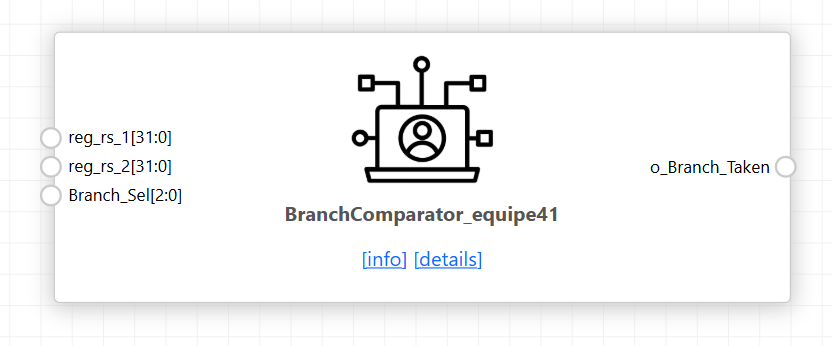

Evaluates the six RV32I branch conditions from `funct3`, driving
`o_Branch_Taken` for the control unit's branch commit state. Three comparisons
are computed in parallel — equality, signed less-than, and unsigned less-than
via `$unsigned` casts — and the six conditions are formed from those by
selection and inversion.

| `funct3` | Branch | Condition |
|---|---|---|
| `000` | BEQ | equal |
| `001` | BNE | not equal |
| `100` | BLT | signed less-than |
| `101` | BGE | not signed less-than |
| `110` | BLTU | unsigned less-than |
| `111` | BGEU | not unsigned less-than |

<details><summary><b>BranchComparator.v</b></summary>

```verilog
module BranchComparator(
    input signed [31:0] reg_rs_1,
    input signed [31:0] reg_rs_2,
    input [2:0] Branch_Sel,         // Matches funct3 [14:12] from the instruction
    output reg o_Branch_Taken
);


    /* Branch Funct3 Codes */
    localparam c_BEQ  = 3'b000;
    localparam c_BNE  = 3'b001;
    localparam c_BLT  = 3'b100;
    localparam c_BGE  = 3'b101;
    localparam c_BLTU = 3'b110;
    localparam c_BGEU = 3'b111;


    /* Comparison Logic */
    wire w_Branch_Equal              = (reg_rs_1 == reg_rs_2);
    wire w_Branch_Less_Than_Signed   = (reg_rs_1 < reg_rs_2);
    wire w_Branch_Less_Than_Unsigned = ($unsigned(reg_rs_1) < $unsigned(reg_rs_2));


    always @ (*) begin
        case (Branch_Sel)
            c_BEQ:  o_Branch_Taken = w_Branch_Equal;
            c_BNE:  o_Branch_Taken = !w_Branch_Equal;
            c_BLT:  o_Branch_Taken = w_Branch_Less_Than_Signed;
            c_BGE:  o_Branch_Taken = !w_Branch_Less_Than_Signed;
            c_BLTU: o_Branch_Taken = w_Branch_Less_Than_Unsigned;
            c_BGEU: o_Branch_Taken = !w_Branch_Less_Than_Unsigned;
            default: o_Branch_Taken = 1'b0;
        endcase
    end


endmodule

```

[Full source →](rtl/BranchComparator.v)

</details>

### Testbench

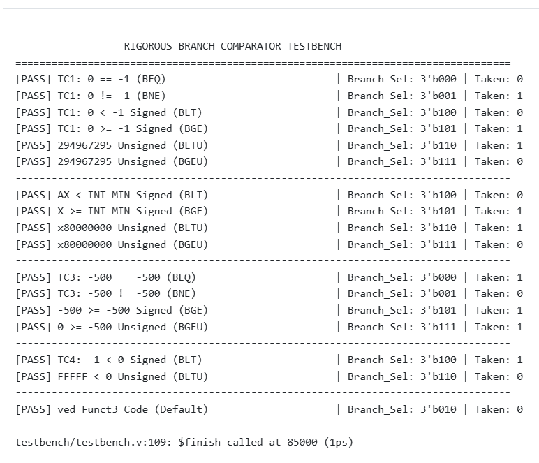

Checks each condition true and false. The decisive cases use operand pairs
where signed and unsigned interpretation disagree — `0x7FFFFFFF` against
`0x80000000` is signed greater-than but unsigned less-than, so BLT and BLTU
must return opposite results on identical inputs.

<details><summary><b>tb_BranchComparator.v</b></summary>

```verilog
`timescale 1ns / 1ps


module testbench;


    // Inputs
    reg signed [31:0] reg_rs_1;
    reg signed [31:0] reg_rs_2;
    reg [2:0] Branch_Sel;


    // Output
    wire o_Branch_Taken;


    // Branch Sel Definitions
    localparam c_BEQ  = 3'b000;
    localparam c_BNE  = 3'b001;
    localparam c_BLT  = 3'b100;
    localparam c_BGE  = 3'b101;
    localparam c_BLTU = 3'b110;
    localparam c_BGEU = 3'b111;


    // Instantiate UUT
    BranchComparator uut (
        .reg_rs_1(reg_rs_1),
        .reg_rs_2(reg_rs_2),
        .Branch_Sel(Branch_Sel),
        .o_Branch_Taken(o_Branch_Taken)
    );


    // Verification Helper Task
    task check_branch(
        input [2:0] sel,
        input expected,
        input [200:1] test_name
    );
        begin
            Branch_Sel = sel;
            #5; // Wait for combinational evaluation
            if (o_Branch_Taken === expected) begin
                $display("[PASS] %-45s | Branch_Sel: 3'b%03b | Taken: %b", test_name, sel, o_Branch_Taken);
            end else begin
                $display("[FAIL] %-45s | Branch_Sel: 3'b%03b | Expected: %b, Got: %b", test_name, sel, expected, o_Branch_Taken);
            end
        end
    endtask


    initial begin
        $display("==================================================================================");
        $display("                  RIGOROUS BRANCH COMPARATOR TESTBENCH                           ");
        $display("==================================================================================");


        // --------------------------------------------------------------------------------
        // TEST CASE 1: Signed vs Unsigned Trap (0 vs -1 / 0xFFFF_FFFF)
        // --------------------------------------------------------------------------------
        reg_rs_1 = 32'h0000_0000; //  0
        reg_rs_2 = 32'hFFFF_FFFF; // -1 (signed) OR 4294967295 (unsigned)
        
        check_branch(c_BEQ,  1'b0, "TC1: 0 == -1 (BEQ)");
        check_branch(c_BNE,  1'b1, "TC1: 0 != -1 (BNE)");
        check_branch(c_BLT,  1'b0, "TC1: 0 < -1 Signed (BLT)");
        check_branch(c_BGE,  1'b1, "TC1: 0 >= -1 Signed (BGE)");
        check_branch(c_BLTU, 1'b1, "TC1: 0 < 4294967295 Unsigned (BLTU)");
        check_branch(c_BGEU, 1'b0, "TC1: 0 >= 4294967295 Unsigned (BGEU)");


        $display("----------------------------------------------------------------------------------");


        // --------------------------------------------------------------------------------
        // TEST CASE 2: Extreme Limits (INT_MAX vs INT_MIN)
        // --------------------------------------------------------------------------------
        reg_rs_1 = 32'h7FFF_FFFF; // +2147483647 (INT_MAX)
        reg_rs_2 = 32'h8000_0000; // -2147483648 (INT_MIN)


        check_branch(c_BLT,  1'b0, "TC2: INT_MAX < INT_MIN Signed (BLT)");
        check_branch(c_BGE,  1'b1, "TC2: INT_MAX >= INT_MIN Signed (BGE)");
        check_branch(c_BLTU, 1'b1, "TC2: 0x7FFFFFFF < 0x80000000 Unsigned (BLTU)");
        check_branch(c_BGEU, 1'b0, "TC2: 0x7FFFFFFF >= 0x80000000 Unsigned (BGEU)");


        $display("----------------------------------------------------------------------------------");


        // --------------------------------------------------------------------------------
        // TEST CASE 3: Equal Negative Values (-500 vs -500)
        // --------------------------------------------------------------------------------
        reg_rs_1 = -32'sd500; // 32'hFFFF_FE0C
        reg_rs_2 = -32'sd500; // 32'hFFFF_FE0C


        check_branch(c_BEQ,  1'b1, "TC3: -500 == -500 (BEQ)");
        check_branch(c_BNE,  1'b0, "TC3: -500 != -500 (BNE)");
        check_branch(c_BGE,  1'b1, "TC3: -500 >= -500 Signed (BGE)");
        check_branch(c_BGEU, 1'b1, "TC3: -500 >= -500 Unsigned (BGEU)");


        $display("----------------------------------------------------------------------------------");


        // --------------------------------------------------------------------------------
        // TEST CASE 4: Off-By-One Near Zero
        // --------------------------------------------------------------------------------
        reg_rs_1 = -32'sd1;   // 32'hFFFF_FFFF
        reg_rs_2 = 32'sd0;    // 32'h0000_0000


        check_branch(c_BLT,  1'b1, "TC4: -1 < 0 Signed (BLT)");
        check_branch(c_BLTU, 1'b0, "TC4: 0xFFFFFFFF < 0 Unsigned (BLTU)");


        $display("----------------------------------------------------------------------------------");


        // --------------------------------------------------------------------------------
        // TEST CASE 5: Invalid/Unused Funct3 Code
        // --------------------------------------------------------------------------------
        check_branch(3'b010, 1'b0, "TC5: Reserved Funct3 Code (Default)");


        $display("==================================================================================");
        $finish;
    end


endmodule

```

[Full source →](tb/tb_BranchComparator.v)

</details>

---

## Multiplier

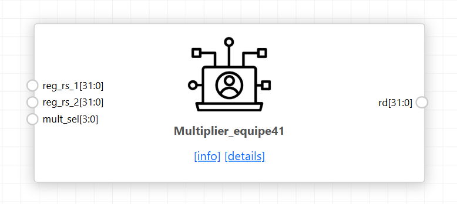

Covers the four Zmmul instructions. Three 64-bit products are computed —
signed×signed, signed×unsigned and unsigned×unsigned — and `mult_sel`, taken
from `funct3`, selects which half of which product reaches `rd`. MUL returns
the low 32 bits, which are identical regardless of signedness; the three MULH
variants return the upper 32 bits of the matching product.

| `mult_sel` | Instruction | Output |
|---|---|---|
| `0` | MUL | `mul_ss[31:0]` |
| `1` | MULH | `mul_ss[63:32]` |
| `2` | MULHSU | `mul_su[63:32]` |
| `3` | MULHU | `mul_uu[63:32]` |

<details><summary><b>Multiplier.v</b></summary>

```verilog
`define MUL 4'h0
`define MULH 4'h1
`define MULHSU 4'h2
`define MULHU 4'h3


module Multiplier(
    input [31:0] reg_rs_1,
    input [31:0] reg_rs_2,
    input  [3:0]  mult_sel,
    output reg [31:0] rd
    );
    //All 3 values are always calculated just use mux to selct the values
    wire signed [63:0] mul_ss; // Signed x Signed => Signed
    wire signed [63:0] mul_su; // Signed x Unsigned => Signed
    wire        [63:0] mul_uu; // Unsigned x Unsigned => Unsigned


    // Compute 64-bit intermediate products
    assign mul_ss = $signed(reg_rs_1) * $signed(reg_rs_2);
    assign mul_su = $signed({reg_rs_1[31], reg_rs_1}) * $signed({1'b0, reg_rs_2}); // Zero-extend rs2 to prevent sign treatment
    assign mul_uu = $unsigned(reg_rs_1) * $unsigned(reg_rs_2);


    always @(*) begin
        case (mult_sel)
            `MUL: rd = mul_ss[31:0];  // MUL  : lower 32 bits (Signed or Unsigned give same lower bits)
            `MULH: rd = mul_ss[63:32]; // MULH : upper 32 bits (Signed * Signed)
            `MULHSU: rd = mul_su[63:32]; // MULHSU: upper 32 bits (Signed * Unsigned)
            `MULHU: rd = mul_uu[63:32]; // MULHU: upper 32 bits (Unsigned * Unsigned)
            default: rd = 32'h0;
        endcase
    end
endmodule

```

[Full source →](rtl/Multiplier.v)

</details>

### Testbench

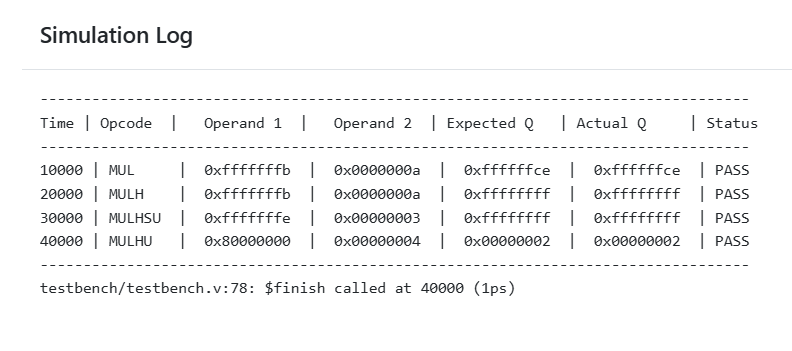

Stresses the upper and lower halves of the product with operands whose signed
and unsigned interpretations differ. `0xFFFFFFFB` against `0x0000000A` gives
`0xFFFFFFCE` for MUL and `0xFFFFFFFF` for MULH, but `0x00000009` for MULHU —
the same input bits, three different results.

<details><summary><b>tb_Multiplier.v</b></summary>

```verilog
`timescale 1ns / 1ps

module testbench();

    reg [31:0] reg_rs_1;
    reg [31:0] reg_rs_2;
    reg [3:0]  mult_sel;
    wire [31:0] rd;

    reg [31:0] expected_rd;

    Multiplier uut (
        .reg_rs_1(reg_rs_1),
        .reg_rs_2(reg_rs_2),
        .mult_sel(mult_sel),
        .rd(rd)
    );

    initial begin
        $display("----------------------------------------------------------------------------------");
        $display("Time | Opcode  |   Operand 1  |   Operand 2  | Expected Q   | Actual Q     | Status");
        $display("----------------------------------------------------------------------------------");

        // Test Setup: Large numbers to stress upper/lower 32-bit slices
        // reg_rs_1 = -5 (0xFFFFFFFB)
        // reg_rs_2 = +10 (0x0000000A)
        reg_rs_1 = 32'hFFFF_FFFB; 
        reg_rs_2 = 32'h0000_000A;

        // --------------------------------------------------------------------
        // Test 1: MUL (Lower 32 bits)
        // --------------------------------------------------------------------
        mult_sel = `MUL;
        expected_rd = ($signed(reg_rs_1) * $signed(reg_rs_2));
        #10;
        $display("%4t | MUL     |  0x%h  |  0x%h  |  0x%h  |  0x%h  | %s", 
                 $time, reg_rs_1, reg_rs_2, expected_rd, rd, (rd === expected_rd) ? "PASS" : "FAIL");

        // --------------------------------------------------------------------
        // Test 2: MULH (Signed * Signed, Upper 32 bits)
        // -5 * +10 = -50 (64-bit: 0xFFFFFFFFFFFFFFCE) -> Upper 32 = 0xFFFFFFFF
        // --------------------------------------------------------------------
        mult_sel = `MULH;
        expected_rd = 32'hFFFF_FFFF;
        #10;
        $display("%4t | MULH    |  0x%h  |  0x%h  |  0x%h  |  0x%h  | %s", 
                 $time, reg_rs_1, reg_rs_2, expected_rd, rd, (rd === expected_rd) ? "PASS" : "FAIL");

        // --------------------------------------------------------------------
        // Test 3: MULHSU (Signed * Unsigned, Upper 32 bits)
        // reg_rs_1 = -2 (0xFFFFFFFE)
        // reg_rs_2 = 3 (0x00000003)
        // --------------------------------------------------------------------
        reg_rs_1 = 32'hFFFF_FFFE;
        reg_rs_2 = 32'h0000_0003;
        mult_sel = `MULHSU;
        expected_rd = 32'hFFFF_FFFF; // Upper bits of (-2 * 3)
        #10;
        $display("%4t | MULHSU  |  0x%h  |  0x%h  |  0x%h  |  0x%h  | %s", 
                 $time, reg_rs_1, reg_rs_2, expected_rd, rd, (rd === expected_rd) ? "PASS" : "FAIL");

        // --------------------------------------------------------------------
        // Test 4: MULHU (Unsigned * Unsigned, Upper 32 bits)
        // reg_rs_1 = 0x8000_0000 (2,147,483,648 unsigned)
        // reg_rs_2 = 0x0000_0004 (4 unsigned)
        // Product = 0x2_0000_0000 -> Upper 32 bits = 0x0000_0002
        // --------------------------------------------------------------------
        reg_rs_1 = 32'h8000_0000;
        reg_rs_2 = 32'h0000_0004;
        mult_sel = `MULHU;
        expected_rd = 32'h0000_0002;
        #10;
        $display("%4t | MULHU   |  0x%h  |  0x%h  |  0x%h  |  0x%h  | %s", 
                 $time, reg_rs_1, reg_rs_2, expected_rd, rd, (rd === expected_rd) ? "PASS" : "FAIL");

        $display("----------------------------------------------------------------------------------");
        $finish;
    end

endmodule

```

[Full source →](tb/tb_Multiplier.v)

</details>

---

## CRC

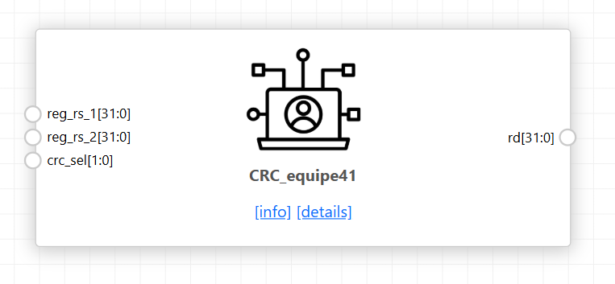

CRC-16/IBM-3740 over byte, halfword or word payloads: polynomial `0x1021`,
seed from `reg_rs_2[15:0]`, no input or output reflection, no final XOR. Three
`crc_calc` instances run in parallel and `crc_sel` picks the width. The result
is zero-extended to 32 bits and can be fed straight back into the seed to chain
across a longer message. Because `REF_IN = 0` the payload is consumed MSB
first, so a word payload `0x34333231` is the byte sequence `34 33 32 31`.

<details><summary><b>CRC.v</b></summary>

```verilog
module CRC (
    input wire [31:0] reg_rs_1, // Input data payload
    input wire [31:0] reg_rs_2, // 32-bit register input (uses [15:0] as seed/chained CRC)
    input wire [1:0]  crc_sel,  // Mode Select: 2'b00 = 8-bit, 2'b01 = 16-bit, 2'b10 = 32-bit
    output reg [31:0] rd        // Zero-extended 16-bit CRC output result
);


    wire [15:0] crc8_out;
    wire [15:0] crc16_out;
    wire [15:0] crc32_out;


    // ------------------------------------------------------------------------
    // 8-bit Input Mode Engine (Processes reg_rs_1[7:0])
    // ------------------------------------------------------------------------
    crc_calc #(
        .POLY(64'h1021),
        .CRC_SIZE(16),
        .DATA_WIDTH(8),
        .REF_IN(0),
        .REF_OUT(0),
        .XOR_OUT(64'h0000)
    ) u_crc8 (
        .crc_in(reg_rs_2[15:0]),
        .data_i(reg_rs_1[7:0]),
        .crc_o(crc8_out)
    );


    // ------------------------------------------------------------------------
    // 16-bit Input Mode Engine (Processes reg_rs_1[15:0])
    // ------------------------------------------------------------------------
    crc_calc #(
        .POLY(64'h1021),
        .CRC_SIZE(16),
        .DATA_WIDTH(16),
        .REF_IN(0),
        .REF_OUT(0),
        .XOR_OUT(64'h0000)
    ) u_crc16 (
        .crc_in(reg_rs_2[15:0]),
        .data_i(reg_rs_1[15:0]),
        .crc_o(crc16_out)
    );


    // ------------------------------------------------------------------------
    // 32-bit Input Mode Engine (Processes reg_rs_1[31:0])
    // ------------------------------------------------------------------------
    crc_calc #(
        .POLY(64'h1021),
        .CRC_SIZE(16),
        .DATA_WIDTH(32),
        .REF_IN(0),
        .REF_OUT(0),
        .XOR_OUT(64'h0000)
    ) u_crc32 (
        .crc_in(reg_rs_2[15:0]),
        .data_i(reg_rs_1[31:0]),
        .crc_o(crc32_out)
    );


    // ------------------------------------------------------------------------
    // Output Select Multiplexer
    // ------------------------------------------------------------------------
    always @(*) begin
        case (crc_sel)
            2'b00:   rd = {16'h0000, crc8_out};  // 8-bit Input
            2'b01:   rd = {16'h0000, crc16_out}; // 16-bit Input
            2'b10:   rd = {16'h0000, crc32_out}; // 32-bit Input
            default: rd = 32'h0000_0000;
        endcase
    end


endmodule


module crc_calc #(
    parameter [63:0]  POLY       = 64'h8005,
    parameter integer CRC_SIZE   = 16,
    parameter integer DATA_WIDTH = 8,
    parameter integer REF_IN     = 1,
    parameter integer REF_OUT    = 1,
    parameter [63:0]  XOR_OUT    = 64'hFFFF
)(
    input  [CRC_SIZE - 1 : 0]   crc_in,   // Seed or previous CRC result from reg_rs_2
    input  [DATA_WIDTH - 1 : 0] data_i,   // Data payload segment
    output [CRC_SIZE - 1 : 0]   crc_o     // Calculated 16-bit CRC output
);


    // Un-XOR the incoming seed state so output results can chain directly back into crc_in
    wire [CRC_SIZE - 1 : 0] current_state = crc_in ^ XOR_OUT[CRC_SIZE - 1 : 0];


    reg [CRC_SIZE - 1 : 0] crc_next;
    reg [CRC_SIZE - 1 : 0] crc_prev;


    integer i, j;


    assign crc_o = crc_next ^ XOR_OUT[CRC_SIZE - 1 : 0];


    generate
        if (REF_OUT) begin : g_ref_out
            if (REF_IN) begin : g_ref_in
                always @(*) begin
                    crc_next = current_state;
                    crc_prev = current_state;
                    for (i = 0; i < DATA_WIDTH; i = i + 1) begin
                        crc_next[CRC_SIZE - 1] = crc_prev[0] ^ data_i[i];
                        for (j = 1; j < CRC_SIZE; j = j + 1) begin
                            if (POLY[j])
                                crc_next[CRC_SIZE - 1 - j] = crc_prev[CRC_SIZE - j] ^ crc_prev[0] ^ data_i[i];
                            else
                                crc_next[CRC_SIZE - 1 - j] = crc_prev[CRC_SIZE - j];
                        end
                        crc_prev = crc_next;
                    end
                end
            end else begin : g_n_ref_in
                always @(*) begin
                    crc_next = current_state;
                    crc_prev = current_state;
                    for (i = 0; i < DATA_WIDTH; i = i + 1) begin
                        crc_next[0] = crc_prev[CRC_SIZE - 1] ^ data_i[i];
                        for (j = 1; j < CRC_SIZE; j = j + 1) begin
                            if (POLY[j])
                                crc_next[j] = crc_prev[j - 1] ^ crc_prev[CRC_SIZE - 1] ^ data_i[i];
                            else
                                crc_next[j] = crc_prev[j - 1];
                        end
                        crc_prev = crc_next;
                    end
                end
            end
        end else begin : g_n_ref_out
            if (REF_IN) begin : g_ref_in
                always @(*) begin
                    crc_next = current_state;
                    crc_prev = current_state;
                    for (i = 0; i < DATA_WIDTH; i = i + 1) begin
                        crc_next[CRC_SIZE - 1] = crc_prev[0] ^ data_i[DATA_WIDTH - 1 - i];
                        for (j = 1; j < CRC_SIZE; j = j + 1) begin
                            if (POLY[j])
                                crc_next[CRC_SIZE - 1 - j] = crc_prev[CRC_SIZE - j] ^ crc_prev[0] ^ data_i[DATA_WIDTH - 1 - i];
                            else
                                crc_next[CRC_SIZE - 1 - j] = crc_prev[CRC_SIZE - j];
                        end
                        crc_prev = crc_next;
                    end
                end
            end else begin : g_n_ref_in
                always @(*) begin
                    crc_next = current_state;
                    crc_prev = current_state;
                    for (i = 0; i < DATA_WIDTH; i = i + 1) begin
                        crc_next[0] = crc_prev[CRC_SIZE - 1] ^ data_i[DATA_WIDTH - 1 - i];
                        for (j = 1; j < CRC_SIZE; j = j + 1) begin
                            if (POLY[j])
                                crc_next[j] = crc_prev[j - 1] ^ crc_prev[CRC_SIZE - 1] ^ data_i[DATA_WIDTH - 1 - i];
                            else
                                crc_next[j] = crc_prev[j - 1];
                        end
                        crc_prev = crc_next;
                    end
                end
            end
        end
    endgenerate


endmodule

```

[Full source →](rtl/CRC.v)

</details>

### Testbench

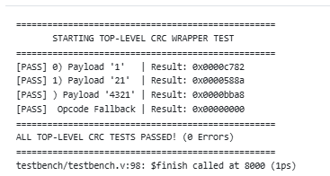

Checks each width against independently computed CRC-16/IBM-3740 values, plus
the undefined-selector fallback. `reg_rs_2` carries a non-zero upper half to
confirm only bits `[15:0]` are used as the seed.

| `crc_sel` | Payload | Result |
|---|---|---|
| `00` | `0x31` | `0x0000C782` |
| `01` | `0x3231` | `0x0000588A` |
| `10` | `0x34333231` | `0x0000BBA8` |
| `11` | — | `0x00000000` |

<details><summary><b>tb_CRC.v</b></summary>

```verilog
`timescale 1ns / 1ps


module testbench();


    // --------------------------------------------------------
    // Testbench Signals
    // --------------------------------------------------------
    reg  [31:0] reg_rs_1;
    reg  [31:0] reg_rs_2;
    reg  [1:0]  crc_sel;
    wire [31:0] rd;


    integer error_count = 0;


    // --------------------------------------------------------
    // Instantiate Unit Under Test (UUT)
    // --------------------------------------------------------
    CRC uut (
        .reg_rs_1(reg_rs_1),
        .reg_rs_2(reg_rs_2),
        .crc_sel(crc_sel),
        .rd(rd)
    );


    // --------------------------------------------------------
    // Verification Task
    // --------------------------------------------------------
    task check_rd(
        input [31:0] expected_rd,
        input [127:0] test_name
    );
        begin
            #1; // Delay for combinational propagation
            if (rd !== expected_rd) begin
                $display("[FAIL] %0s | Got: 0x%h, Expected: 0x%h", test_name, rd, expected_rd);
                error_count = error_count + 1;
            end else begin
                $display("[PASS] %0s | Result: 0x%h", test_name, rd);
            end
        end
    endtask


    // --------------------------------------------------------
    // Main Test Sequence
    //
    // Configuration under test: CRC-16/IBM-3740
    //   POLY = 0x1021, seed = 0xFFFF, REF_IN = 0, REF_OUT = 0, XOR_OUT = 0x0000
    //
    // REF_IN = 0 means the payload is processed most-significant bit first,
    // so a 32-bit payload 0x34333231 is the byte sequence 34 33 32 31 = "4321".
    // --------------------------------------------------------
    initial begin
        $display("==================================================");
        $display("       STARTING TOP-LEVEL CRC WRAPPER TEST        ");
        $display("==================================================");


        // Initialize inputs
        reg_rs_1 = 32'h0000_0000;
        reg_rs_2 = 32'h1234_FFFF; // Upper 16 bits set to 1234 to verify ignore
        crc_sel  = 2'b00;


        // --- TEST 1: 8-bit Mode (crc_sel = 2'b00) ---
        // Payload: 8'h31 ('1'), Seed: 0xFFFF -> Expected: 0x0000C782
        reg_rs_1 = 32'h0000_0031;
        reg_rs_2 = 32'hABCD_FFFF;
        crc_sel  = 2'b00;
        #1;
        check_rd(32'h0000_C782, "8-bit Mode  (crc_sel = 00) Payload '1'  ");


        // --- TEST 2: 16-bit Mode (crc_sel = 2'b01) ---
        // Payload: 16'h3231 ("21", MSB first), Seed: 0xFFFF -> Expected: 0x0000588A
        reg_rs_1 = 32'h0000_3231;
        reg_rs_2 = 32'h0000_FFFF;
        crc_sel  = 2'b01;
        #1;
        check_rd(32'h0000_588A, "16-bit Mode (crc_sel = 01) Payload '21' ");


        // --- TEST 3: 32-bit Mode (crc_sel = 2'b10) ---
        // Payload: 32'h3433_3231 ("4321", MSB first), Seed: 0xFFFF -> Expected: 0x0000BBA8
        reg_rs_1 = 32'h3433_3231;
        reg_rs_2 = 32'hFFFF_FFFF;
        crc_sel  = 2'b10;
        #1;
        check_rd(32'h0000_BBA8, "32-bit Mode (crc_sel = 10) Payload '4321'");


        // --- TEST 4: Invalid Selector Fallback ---
        crc_sel  = 2'b11;
        #1;
        check_rd(32'h0000_0000, "Undefined Opcode Fallback");


        $display("==================================================");
        if (error_count == 0) begin
            $display("ALL TOP-LEVEL CRC TESTS PASSED! (0 Errors)");
        end else begin
            $display("TESTBENCH FAILED WITH %0d ERROR(S)", error_count);
        end
        $display("==================================================");
        $finish;
    end


endmodule

```

[Full source →](tb/tb_CRC.v)

</details>

---

## ImmediateGenerator

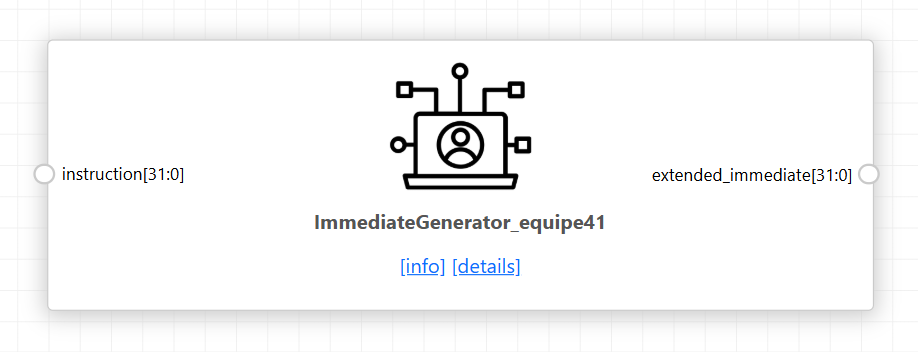

Extracts and sign-extends the immediate field for every RISC-V format, choosing
by opcode. B and J formats reassemble scattered instruction bits and append an
implicit zero, giving the 2-byte alignment branches and jumps require. U format
is not sign-extended — the 20-bit field is placed in the upper bits with zeros
below.

| Opcode | Format | Source bits |
|---|---|---|
| `1101111` JAL | J | `[31]`, `[19:12]`, `[20]`, `[30:25]`, `[24:21]`, `0` |
| `1100011` BRANCH | B | `[31]`, `[7]`, `[30:25]`, `[11:8]`, `0` |
| `0100011` STORE | S | `[31:25]`, `[11:7]` |
| `0110111` / `0010111` LUI, AUIPC | U | `[31:12]`, 12 zeros |
| all others | I | `[31:20]` |

<details><summary><b>ImmediateGenerator.v</b></summary>

```verilog
module ImmediateGenerator(
    input wire [31:0] instruction,
    output reg [31:0] extended_immediate


    );


    /* Instruction Opcodes */
   
    // I-TYPE
    localparam c_OPCODE_JALR = 7'b1100111;
    localparam c_OPCODE_IMME_ALU = 7'b0010011;
    localparam c_OPCODE_SYS = 7'b1110011;
    localparam c_OPCODE_FENCE = 7'b0001111;


    // U-TYPE
    localparam c_OPCODE_LUI = 7'b0110111;
    localparam c_OPCODE_AUIPC = 7'b0010111;


    // S-TYPE
    localparam c_OPCODE_STORE  = 7'b0100011;
   
    // B-TYPE
    localparam c_OPCODE_BRANCH = 7'b1100011;
    // J-TYPE
    localparam c_OPCODE_JAL = 7'b1101111;


    // reference from the format in riscv instructions
    wire [11:0] w_I_Type_Imm = instruction[31:20];
    wire [11:0] w_S_Type_Imm = {instruction[31:25], instruction[11:7]};
    wire [12:0] w_B_Type_Imm = {instruction[31], instruction[7], instruction[30:25], instruction[11:8], 1'b0};
    wire [20:0] w_J_Type_Imm = {instruction[31], instruction[19:12], instruction[20], instruction[30:25], instruction[24:21], 1'b0};
    wire [31:0] w_U_Type_Imm = {instruction[31:12], 12'b0};


    always @ (*) begin
        case (instruction[6:0])
            c_OPCODE_JAL:
                extended_immediate = $signed(w_J_Type_Imm);
            c_OPCODE_BRANCH:
                extended_immediate = $signed(w_B_Type_Imm);
            c_OPCODE_STORE:
                extended_immediate = $signed(w_S_Type_Imm);
            c_OPCODE_LUI, c_OPCODE_AUIPC:
                extended_immediate = w_U_Type_Imm;
            default:
                extended_immediate = $signed(w_I_Type_Imm);
        endcase
    end
endmodule

```

[Full source →](rtl/ImmediateGenerator.v)

</details>

### Testbench

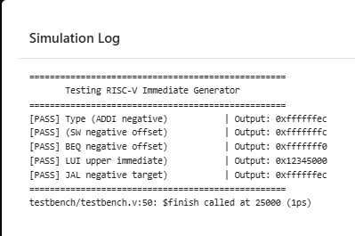

Feeds one instruction per format and compares against the hand-decoded
immediate. Negative offsets confirm sign extension; B and J cases confirm bit 0
is always zero and that the scattered fields are reassembled in the right
order.

<details><summary><b>tb_ImmediateGenerator.v</b></summary>

```verilog
`timescale 1ns / 1ps


module testbench;


    reg [31:0] instruction;
    wire [31:0] extended_immediate;


    ImmediateGenerator uut (
        .instruction(instruction),
        .extended_immediate(extended_immediate)
    );


    task check_result(input [31:0] expected, input [160:1] test_label);
        begin
            #5;
            if (extended_immediate === expected) begin
                $display("[PASS] %-30s | Output: 0x%h", test_label, extended_immediate);
            end else begin
                $display("[FAIL] %-30s | Expected: 0x%h, Got: 0x%h", test_label, expected, extended_immediate);
            end
        end
    endtask


    initial begin
        $display("==================================================");
        $display("       Testing RISC-V Immediate Generator         ");
        $display("==================================================");


        // 1. I-Type Test: ADDI x1, x2, -20 (Imm = -20 / 12'hFEC)
        instruction = 32'hFEC10093;
        check_result(32'hFFFFFFEC, "I-Type (ADDI negative)");


        // 2. S-Type Test: SW x2, -4(x1) (Imm = -4 / 12'hFFC) -> FIXED HEX
        instruction = 32'hFE20AE23;
        check_result(32'hFFFFFFFC, "S-Type (SW negative offset)");


        // 3. B-Type Test: BEQ x1, x2, -16 (Imm = -16 / 13'h1FF0)
        instruction = 32'hFE2088E3;
        check_result(32'hFFFFFFF0, "B-Type (BEQ negative offset)");


        // 4. U-Type Test: LUI x1, 0x12345 (Imm = 0x12345000)
        instruction = 32'h123450B7;
        check_result(32'h12345000, "U-Type (LUI upper immediate)");


        // 5. J-Type Test: JAL x1, -20 (Imm = -20 / 21'h1FFFEC) -> FIXED HEX
        instruction = 32'hFEDFF0EF;
        check_result(32'hFFFFFFEC, "J-Type (JAL negative target)");


        $display("==================================================");
        $finish;
    end


endmodule

```

[Full source →](tb/tb_ImmediateGenerator.v)

</details>

---

## MemoryUnit

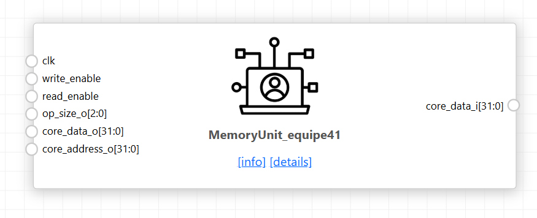

Wraps the load-store unit, address decoder, instruction memory and data memory
behind one interface. IMEM reads asynchronously and DMEM synchronously, so the
decoder select is registered and the read multiplexer picks the DMEM word one
cycle late while routing IMEM combinationally.

Four submodules:

- **LSU** — sign or zero extends loads (LB, LH, LBU, LHU), lane-shifts store
  data, and generates the 4-bit byte-write mask for SB, SH and SW
- **AddressDecoder** — routes by range and rebases: `0x00400000` → IMEM,
  `0x10010000` → DMEM, each mapped to zero before the memory sees it
- **IMEM** — instruction memory, asynchronous read, firmware held in decode
  logic rather than `$readmemh` so no external file is required
- **DMEM** — four byte-wide arrays sharing one word index, so a byte or
  halfword write updates only the selected lanes

<details><summary><b>MemoryUnit.v</b></summary>

```verilog
module MemoryUnit(
    input  wire        clk,
    input  wire        write_enable,
    input  wire        read_enable,
    input  wire [2:0]  op_size_o,
    input  wire [31:0] core_data_o,     // rs2 data from core for stores
    input  wire [31:0] core_address_o,  // Memory address from core
    output wire [31:0] core_data_i      // Formatted load data to core
);

    // -------------------------------------------------------------------------
    // Internal Wires for Interconnects
    // -------------------------------------------------------------------------
    wire [31:0] lsu_mem_addr;
    wire [31:0] lsu_mem_data;
    wire [3:0]  lsu_byte_write;

    wire [31:0] imem_addr;
    wire        imem_read_en;

    wire [31:0] dmem_addr;
    wire        dmem_read_en;
    wire        dmem_write_en;
    wire [3:0]  dmem_bw;

    wire        addr_decoder_sel;
    wire [31:0] imem_out;
    wire [31:0] dmem_out;
    wire [31:0] mux_mem_data_out;

    // Register decoder select to match the 1-cycle memory read latency
    reg addr_decoder_sel_q;
    always @(posedge clk) begin
        addr_decoder_sel_q <= addr_decoder_sel;
    end

    // -------------------------------------------------------------------------
    // 1. Read Data MUX (Mixed Latency: Async IMEM vs. Sync DMEM)
    // -------------------------------------------------------------------------
    // - If current cycle is accessing DMEM (addr_decoder_sel = 1), wait for 
    //   addr_decoder_sel_q to select dmem_out on the next cycle.
    // - If accessing IMEM (addr_decoder_sel = 0), route imem_out combinationally.
    // -------------------------------------------------------------------------
    assign mux_mem_data_out = (addr_decoder_sel) ? ((addr_decoder_sel_q) ? dmem_out : 32'h00000000) 
                                                  : imem_out;

    // -------------------------------------------------------------------------
    // 2. Load-Store Unit (LSU) Instance
    // -------------------------------------------------------------------------
    LSU u_lsu (
        .core_data_o   (core_data_o),
        .core_address_o(core_address_o),
        .op_size_o     (op_size_o),
        .core_data_i   (core_data_i),

        .mem_address_i (lsu_mem_addr),
        .mem_data_i    (lsu_mem_data),
        .byte_write_i  (lsu_byte_write),
        .mem_data_o    (mux_mem_data_out)
    );

    // -------------------------------------------------------------------------
    // 3. Address Decoder Instance
    // -------------------------------------------------------------------------
    AddressDecoder u_addr_decoder (
        .addr_i          (lsu_mem_addr),
        .read_enable_i   (read_enable),
        .write_enable_i  (write_enable),
        .bw_i            (lsu_byte_write),

        .imem_addr_o     (imem_addr),
        .imem_read_en_o  (imem_read_en),

        .dmem_addr_o     (dmem_addr),
        .dmem_read_en_o  (dmem_read_en),
        .dmem_write_en_o (dmem_write_en),
        .dmem_bw_o       (dmem_bw),

        .addr_decoder_sel(addr_decoder_sel)
    );

    // -------------------------------------------------------------------------
    // 4. Instruction Memory (IMEM) Instance
    // -------------------------------------------------------------------------
    IMEM #(
      .WORDS(1048576)
    ) u_imem (
        .clk        (clk),
        .imem_addr  (imem_addr),
        .read_enable(imem_read_en),
        .imem_output(imem_out)
    );

    // -------------------------------------------------------------------------
    // 5. Data Memory (DMEM) Instance
    // -------------------------------------------------------------------------
    DMEM #(
      .WORDS(2048)
    ) u_dmem (
        .clk         (clk),
        .dmem_addr   (dmem_addr),
        .dmem_data_i (lsu_mem_data),
        .bw          (dmem_bw),
        .write_enable(dmem_write_en),
        .read_enable (dmem_read_en),
        .dmem_output (dmem_out)
    );

endmodule

module LSU(
    // RISC-V Core Interface
    input  wire [31:0] core_data_o,     // rs2 data for stores
    input  wire [31:0] core_address_o,  // Target memory address
    input  wire [2:0]  op_size_o,       // LSU operation code
    output reg  [31:0] core_data_i,     // rd formatted data for loads

    // Address Decoder Interface
    output reg  [31:0] mem_address_i,   // Full 32-bit address passed to Decoder
    output reg  [31:0] mem_data_i,      // Lane-shifted store data
    output reg  [3:0]  byte_write_i,    // 4-bit byte-write mask
    input  wire [31:0] mem_data_o       // 32-bit word read from memory
);

    localparam c_LW  = 3'b000;
    localparam c_LH  = 3'b001;
    localparam c_LB  = 3'b010;
    localparam c_LHU = 3'b011;
    localparam c_LBU = 3'b100;
    localparam c_SW  = 3'b101;
    localparam c_SH  = 3'b110;
    localparam c_SB  = 3'b111;

    wire [1:0] offset = core_address_o[1:0];

    // Select target byte from memory word based on offset
    reg [7:0] selected_byte;
    always @(*) begin
        case(offset)
            2'b00: selected_byte = mem_data_o[7:0];
            2'b01: selected_byte = mem_data_o[15:8];
            2'b10: selected_byte = mem_data_o[23:16];
            2'b11: selected_byte = mem_data_o[31:24];
        endcase
    end

    // Select target half-word from memory word based on offset
    reg [15:0] selected_half;
    always @(*) begin
        case(offset[1])
            1'b0: selected_half = mem_data_o[15:0];
            1'b1: selected_half = mem_data_o[31:16];
        endcase
    end

    // 1. Address Passthrough
    always @(*) begin
        mem_address_i = core_address_o;
    end

    // 2. Store Data Alignment & Byte Write Generation
    always @(*) begin
        case(op_size_o)
            c_SW: begin
                byte_write_i = 4'b1111;
                mem_data_i   = core_data_o;
            end
            c_SH: begin
                case(offset[1])
                    1'b0: begin
                        byte_write_i = 4'b0011;
                        mem_data_i   = {16'h0000, core_data_o[15:0]};
                    end
                    1'b1: begin
                        byte_write_i = 4'b1100;
                        mem_data_i   = {core_data_o[15:0], 16'h0000};
                    end
                endcase
            end
            c_SB: begin
                case(offset)
                    2'b00: begin
                        byte_write_i = 4'b0001;
                        mem_data_i   = {24'h000000, core_data_o[7:0]};
                    end
                    2'b01: begin
                        byte_write_i = 4'b0010;
                        mem_data_i   = {16'h0000, core_data_o[7:0], 8'h00};
                    end
                    2'b10: begin
                        byte_write_i = 4'b0100;
                        mem_data_i   = {8'h00, core_data_o[7:0], 16'h0000};
                    end
                    2'b11: begin
                        byte_write_i = 4'b1000;
                        mem_data_i   = {core_data_o[7:0], 24'h000000};
                    end
                endcase
            end
            default: begin
                byte_write_i = 4'b0000;
                mem_data_i   = 32'h00000000;
            end
        endcase
    end

    // 3. Load Data Formatting (Sign / Zero Extension)
    always @(*) begin
        case(op_size_o)
            c_LW:  core_data_i = mem_data_o;
            c_LH:  core_data_i = {{16{selected_half[15]}}, selected_half};
            c_LB:  core_data_i = {{24{selected_byte[7]}}, selected_byte};
            c_LHU: core_data_i = {16'h0000, selected_half};
            c_LBU: core_data_i = {24'h000000, selected_byte};
            default: core_data_i = 32'h00000000;
        endcase
    end

endmodule

module AddressDecoder (
    input  wire [31:0] addr_i,          // Address from LSU / MUX
    input  wire        read_enable_i,   // Read signal from Control Unit
    input  wire        write_enable_i,  // Write signal from Control Unit
    input  wire [3:0]  bw_i,            // Byte-write mask from LSU

    output reg  [31:0] imem_addr_o,     // Local address offset for IMEM
    output reg         imem_read_en_o,  // IMEM read enable
    
    output reg  [31:0] dmem_addr_o,     // Local address offset for DMEM
    output reg         dmem_read_en_o,  // DMEM read enable
    output reg         dmem_write_en_o, // DMEM write enable
    output reg  [3:0]  dmem_bw_o,       // Byte-write mask forwarded to DMEM
    
    output reg         addr_decoder_sel // MUX select (0: IMEM, 1: DMEM)
);

    // Memory Range Constants
    localparam IMEM_BASE = 32'h00400000;
    localparam IMEM_HIGH = 32'h007FFFFF; // 4 MB Range

    localparam DMEM_BASE = 32'h10010000;
    localparam DMEM_HIGH = 32'h10011FFF; // 8 kB Range (0x2000 bytes)

    always @(*) begin
        // Default Outputs
        imem_addr_o      = 32'h0;
        imem_read_en_o   = 1'b0;
        dmem_addr_o      = 32'h0;
        dmem_read_en_o   = 1'b0;
        dmem_write_en_o  = 1'b0;
        dmem_bw_o        = 4'b0000;
        addr_decoder_sel = 1'b0;

        // IMEM Address Decoding
        if (addr_i >= IMEM_BASE && addr_i <= IMEM_HIGH) begin
            imem_addr_o      = addr_i - IMEM_BASE; // Map 0x00400000 -> 0x00000000
            imem_read_en_o   = read_enable_i;
            addr_decoder_sel = 1'b0;
        end
        // DMEM Address Decoding
        else if (addr_i >= DMEM_BASE && addr_i <= DMEM_HIGH) begin
            dmem_addr_o      = addr_i - DMEM_BASE; // Map 0x10010000 -> 0x00000000
            dmem_read_en_o   = read_enable_i;
            dmem_write_en_o  = write_enable_i;
            dmem_bw_o        = bw_i;
            addr_decoder_sel = 1'b1;
        end
    end

endmodule

module DMEM #(
    parameter WORDS = 4// 8 kB / 4 bytes per word
)(
    input  wire        clk,
    input  wire [31:0] dmem_addr,    // Relative address from decoder
    input  wire [31:0] dmem_data_i,  // Shifted store payload from LSU
    input  wire [3:0]  bw,           // Byte-write mask from decoder
    input  wire        write_enable,
    input  wire        read_enable,
    output reg  [31:0] dmem_output   // Changed from wire to reg
);

    // Memory array: 4 byte lanes per word
    reg [7:0] mem_b0 [0:WORDS-1];
    reg [7:0] mem_b1 [0:WORDS-1];
    reg [7:0] mem_b2 [0:WORDS-1];
    reg [7:0] mem_b3 [0:WORDS-1];

    // Initialize memory to zero to prevent 'x' propagation in simulation
    integer i;
    initial begin
        for (i = 0; i < WORDS; i = i + 1) begin
            mem_b0[i] = 8'h00;
            mem_b1[i] = 8'h00;
            mem_b2[i] = 8'h00;
            mem_b3[i] = 8'h00;
        end
    end

    // Word indexing: Ignore lower 2 offset bits (Range: 0 to 2047)
    localparam ADDR_WIDTH = $clog2(WORDS);
    wire [ADDR_WIDTH-1:0] word_idx = dmem_addr[(ADDR_WIDTH + 1) : 2];

    // Synchronous Write & Read Operations
    always @(posedge clk) begin
        if (write_enable) begin
            if (bw[0]) mem_b0[word_idx] <= dmem_data_i[7:0];
            if (bw[1]) mem_b1[word_idx] <= dmem_data_i[15:8];
            if (bw[2]) mem_b2[word_idx] <= dmem_data_i[23:16];
            if (bw[3]) mem_b3[word_idx] <= dmem_data_i[31:24];
        end

        // Synchronous Read Output
        if (read_enable) begin
            dmem_output <= {mem_b3[word_idx], mem_b2[word_idx], mem_b1[word_idx], mem_b0[word_idx]};
        end else begin
            dmem_output <= 32'h00000000;
        end
    end

endmodule
module IMEM #(
    parameter WORDS = 1048576 // 4 MB / 4 bytes per word (0x00400000 to 0x007FFFFC)
)(
    input  wire        clk,
    input  wire [31:0] imem_addr,   // Relative address from decoder (0x00000000 - 0x003FFFFC)
    input  wire        read_enable,
    output wire [31:0] imem_output
);

    // -----------------------------------------------------------------------
    // RISC-V test firmware held in decode logic.
    //
    // Replaces $readmemh("firmware.hex") so no external file is required -
    // this elaborates in ChipInventor and synthesises directly.
    //
    // Addresses below are RELATIVE: the AddressDecoder already subtracts
    // IMEM_BASE, so program address 0x00400000 appears here as 0x00000000.
    // Unmapped addresses return 0x00000000, matching the behaviour of an
    // uninitialised memory array.
    // -----------------------------------------------------------------------
    reg [31:0] instruction;

    always @(*) begin
        case (imem_addr)
            32'h00000000: instruction = 32'h100100B7; // lui  x1, 0x10010    ; x1 = DMEM base
            32'h00000004: instruction = 32'hDEADB137; // lui  x2, 0xDEADB    ; x2 upper
            32'h00000008: instruction = 32'hEEF10113; // addi x2, x2, -273   ; x2 = 0xDEADBEEF
            32'h0000000C: instruction = 32'h0020A023; // sw   x2, 0(x1)
            32'h00000010: instruction = 32'h00209223; // sh   x2, 4(x1)
            32'h00000014: instruction = 32'h00208323; // sb   x2, 6(x1)
            32'h00000018: instruction = 32'h0000A183; // lw   x3, 0(x1)      ; expect 0xDEADBEEF
            32'h0000001C: instruction = 32'h0060C203; // lbu  x4, 6(x1)      ; expect 0x000000EF
            32'h00000020: instruction = 32'h004002B7; // lui  x5, 0x00400    ; x5 = IMEM base
            32'h00000024: instruction = 32'h1002A303; // lw   x6, 256(x5)    ; expect 0x0000000A
            32'h00000028: instruction = 32'h0000006F; // jal  x0, 0          ; spin forever

            32'h00000100: instruction = 32'h0000000A; // constant data at 0x00400100

            default:      instruction = 32'h00000000;
        endcase
    end

    assign imem_output = (read_enable) ? instruction : 32'h00000000;

endmodule
```

[Full source →](rtl/MemoryUnit.v)

</details>

### Testbench

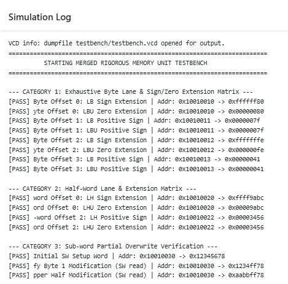
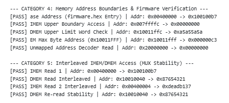

44 tests in six categories: every byte lane and both halfword lanes with sign
and zero extension, sub-word partial overwrite, mixed async/sync latency
arbitration, address-decoder boundaries and unmapped access, and 20 randomised
store/load pairs. The partial-overwrite category is the sharpest check — a word
is written, then a byte and a halfword overwrite parts of it, and the word is
re-read to confirm the untouched lanes survived. **44/44 passed.**

<details><summary><b>tb_MemoryUnit.v</b></summary>

```verilog
`timescale 1ns / 1ps

module testbench();

    // -------------------------------------------------------------------------
    // Signals & Constants
    // -------------------------------------------------------------------------
    reg        clk;
    reg        write_enable;
    reg        read_enable;
    reg  [2:0] op_size_o;
    reg  [31:0] core_data_o;
    reg  [31:0] core_address_o;
    wire [31:0] core_data_i;

    integer test_count  = 0;
    integer error_count = 0;

    // Custom Opcode Encoding
    localparam OP_LW  = 3'b000;
    localparam OP_LH  = 3'b001;
    localparam OP_LB  = 3'b010;
    localparam OP_LHU = 3'b011;
    localparam OP_LBU = 3'b100;
    localparam OP_SW  = 3'b101;
    localparam OP_SH  = 3'b110;
    localparam OP_SB  = 3'b111;

    // Memory Boundaries
    localparam IMEM_BASE = 32'h00400000;
    localparam IMEM_HIGH = 32'h007FFFFC;
    localparam DMEM_BASE = 32'h10010000;
    localparam DMEM_HIGH = 32'h10011FFC; // Max word-aligned address
    localparam UNMAPPED  = 32'h20000000;

    // Instantiate Top Unit
   MemoryUnit dut (
    .clk           (clk),
    .write_enable  (write_enable),
    .read_enable   (read_enable),
    .op_size_o     (op_size_o),
    .core_data_o   (core_data_o),
    .core_address_o(core_address_o),
    .core_data_i   (core_data_i)
);

    // Clock Generation (10ns Period / 100MHz)
    always #5 clk = ~clk;

    // -------------------------------------------------------------------------
    // Core Verification Tasks
    // -------------------------------------------------------------------------
    task memory_write;
        input [31:0] addr;
        input [31:0] data;
        input [2:0]  size;
        begin
            @(posedge clk);
            core_address_o = addr;
            core_data_o    = data;
            op_size_o      = size;
            write_enable   = 1'b1;
            read_enable    = 1'b0;
            @(posedge clk);
            #1;
            write_enable   = 1'b0;
        end
    endtask

    task memory_read_check;
        input [31:0]  addr;
        input [2:0]   size;
        input [31:0]  exp_data;
        input [255:0] test_name;
        begin
            test_count     = test_count + 1;
            @(posedge clk);
            core_address_o = addr;
            op_size_o      = size;
            read_enable    = 1'b1;
            write_enable   = 1'b0;
            
            // 1-cycle latency alignment for synchronous reads
            @(posedge clk);
            #1;

            if (core_data_i !== exp_data) begin
                $display("[FAIL] %0s | Addr: 0x%h, Op: %b", test_name, addr, size);
                $display("       Expected: 0x%h | Got: 0x%h", exp_data, core_data_i);
                error_count = error_count + 1;
            end else begin
                $display("[PASS] %0s | Addr: 0x%h -> 0x%h", test_name, addr, core_data_i);
            end
            read_enable = 1'b0;
        end
    endtask

    // -------------------------------------------------------------------------
    // Main Test Suite
    // -------------------------------------------------------------------------
    integer i;
    reg [31:0] rand_addr;
    reg [31:0] rand_val;

    initial begin
        // Waveform Generation Setup (GTKWave / ModelSim / EDA Playground)
      $dumpfile("testbench.vcd");
      $dumpvars(0, testbench);

        clk            = 0;
        write_enable   = 0;
        read_enable    = 0;
        op_size_o      = 3'b000;
        core_data_o    = 32'h0;
        core_address_o = 32'h0;

        #20;

        $display("=========================================================================");
        $display("          STARTING MERGED RIGOROUS MEMORY UNIT TESTBENCH                 ");
        $display("=========================================================================");

        // ---------------------------------------------------------------------
        // CATEGORY 1: Exhaustive Byte Lane & Sign/Zero Extension Matrix
        // ---------------------------------------------------------------------
        $display("\n--- CATEGORY 1: Exhaustive Byte Lane & Sign/Zero Extension Matrix ---");
        
        // Offset 0 (Sign bit 1 vs 0)
        memory_write(32'h10010010, 32'h00000080, OP_SB);
        memory_read_check(32'h10010010, OP_LB,  32'hFFFFFF80, "Byte Offset 0: LB Sign Extension");
        memory_read_check(32'h10010010, OP_LBU, 32'h00000080, "Byte Offset 0: LBU Zero Extension");

        // Offset 1
        memory_write(32'h10010011, 32'h0000007F, OP_SB);
        memory_read_check(32'h10010011, OP_LB,  32'h0000007F, "Byte Offset 1: LB Positive Sign");
        memory_read_check(32'h10010011, OP_LBU, 32'h0000007F, "Byte Offset 1: LBU Positive Sign");

        // Offset 2
        memory_write(32'h10010012, 32'h000000FE, OP_SB);
        memory_read_check(32'h10010012, OP_LB,  32'hFFFFFFFE, "Byte Offset 2: LB Sign Extension");
        memory_read_check(32'h10010012, OP_LBU, 32'h000000FE, "Byte Offset 2: LBU Zero Extension");

        // Offset 3
        memory_write(32'h10010013, 32'h00000041, OP_SB);
        memory_read_check(32'h10010013, OP_LB,  32'h00000041, "Byte Offset 3: LB Positive Sign");
        memory_read_check(32'h10010013, OP_LBU, 32'h00000041, "Byte Offset 3: LBU Positive Sign");

        // ---------------------------------------------------------------------
        // CATEGORY 2: Half-Word Alignment Matrix
        // ---------------------------------------------------------------------
        $display("\n--- CATEGORY 2: Half-Word Lane & Extension Matrix ---");
        
        // Lower Half (Offset 0)
        memory_write(32'h10010020, 32'h00009ABC, OP_SH);
        memory_read_check(32'h10010020, OP_LH,  32'hFFFF9ABC, "Half-word Offset 0: LH Sign Extension");
        memory_read_check(32'h10010020, OP_LHU, 32'h00009ABC, "Half-word Offset 0: LHU Zero Extension");

        // Upper Half (Offset 2)
        memory_write(32'h10010022, 32'h00003456, OP_SH);
        memory_read_check(32'h10010022, OP_LH,  32'h00003456, "Half-word Offset 2: LH Positive Sign");
        memory_read_check(32'h10010022, OP_LHU, 32'h00003456, "Half-word Offset 2: LHU Zero Extension");

        // ---------------------------------------------------------------------
        // CATEGORY 3: Sub-word Partial Overwrite Verification
        // ---------------------------------------------------------------------
        $display("\n--- CATEGORY 3: Sub-word Partial Overwrite Verification ---");
        
        // Step A: Write full word
        memory_write(32'h10010030, 32'h12345678, OP_SW);
        memory_read_check(32'h10010030, OP_LW, 32'h12345678, "Initial SW Setup Word");

        // Step B: Overwrite Byte Lane 1 with 0xFF
        memory_write(32'h10010031, 32'h000000FF, OP_SB);
        memory_read_check(32'h10010030, OP_LW, 32'h1234FF78, "Verify Byte 1 Modification (SW read)");

        // Step C: Overwrite Upper Half-Word (Bytes 2 and 3) with 0xAABB
        memory_write(32'h10010032, 32'h0000AABB, OP_SH);
        memory_read_check(32'h10010030, OP_LW, 32'hAABBFF78, "Verify Upper Half Modification (SW read)");

       // ---------------------------------------------------------------------
        // CATEGORY 4: Memory Address Boundaries & Firmware Verification
        // ---------------------------------------------------------------------
        $display("\n--- CATEGORY 4: Memory Address Boundaries & Firmware Verification ---");
        
        // Updated expected value to 0x100100b7 (matches firmware.hex)
        memory_read_check(IMEM_BASE, OP_LW, 32'h100100b7, "IMEM Base Address (firmware.hex Entry)");
        memory_read_check(IMEM_HIGH, OP_LW, 32'h00000000, "IMEM Upper Boundary Access");

        // DMEM Upper Limit Word Write/Read
        memory_write(DMEM_HIGH, 32'hA5A55A5A, OP_SW);
        memory_read_check(DMEM_HIGH, OP_LW, 32'hA5A55A5A, "DMEM Upper Limit Word Check");

        // DMEM Max Byte Address
        memory_write(32'h10011FFF, 32'h000000C3, OP_SB);
        memory_read_check(32'h10011FFF, OP_LBU, 32'h000000C3, "DMEM Max Byte Address (0x10011FFF)");

        // Unmapped Address Read Check
        memory_read_check(UNMAPPED, OP_LW, 32'h00000000, "Unmapped Address Decoder Read");

        // ---------------------------------------------------------------------
        // CATEGORY 5: Interleaved Access (Ping-Pong Switching)
        // ---------------------------------------------------------------------
        $display("\n--- CATEGORY 5: Interleaved IMEM/DMEM Access (MUX Stability) ---");
        
        // Updated expected value to 0x100100b7 (matches firmware.hex)
        memory_read_check(IMEM_BASE, OP_LW, 32'h100100b7, "IMEM Read 1");
        memory_write(32'h10010040, 32'h87654321, OP_SW);
        memory_read_check(32'h10010040, OP_LW, 32'h87654321, "DMEM Read Interleaved");
        
        // Updated expected value to 0xdeadb137 (matches firmware.hex offset 0x4)
        memory_read_check(IMEM_BASE + 32'h4, OP_LW, 32'hdeadb137, "IMEM Read 2 Interleaved");
        memory_read_check(32'h10010040, OP_LW, 32'h87654321, "DMEM Re-read Stability");

        // ---------------------------------------------------------------------
        // CATEGORY 6: Pseudo-Random Stress Loop
        // ---------------------------------------------------------------------
        $display("\n--- CATEGORY 6: Pseudo-Random Stress Operations ---");
        
        for (i = 0; i < 20; i = i + 1) begin
            rand_addr = DMEM_BASE + (($urandom % 512) * 4);
            rand_val  = $urandom;

            memory_write(rand_addr, rand_val, OP_SW);
            memory_read_check(rand_addr, OP_LW, rand_val, "Randomized SW/LW Stress Pass");
        end

        // ---------------------------------------------------------------------
        // SUMMARY REPORT
        // ---------------------------------------------------------------------
        $display("\n=========================================================================");
        $display("FINAL VERIFICATION RESULTS: Executed %0d Tests", test_count);
        if (error_count == 0) begin
            $display("STATUS: [ALL RIGOROUS MEMORY UNIT TESTS PASSED]");
        end else begin
            $display("STATUS: [FAILED %0d TESTS]", error_count);
        end
        $display("=========================================================================");
        $finish;
    end

endmodule

```

[Full source →](tb/tb_MemoryUnit.v)

</details>

---

## ProgramCounter

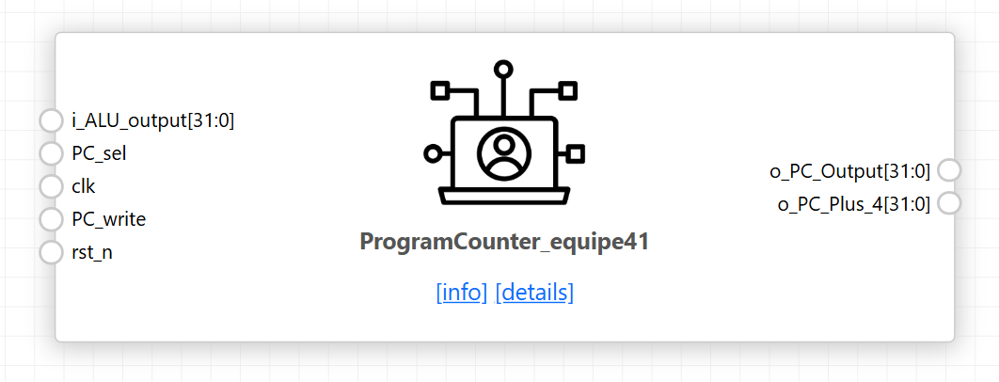

Holds the program counter and computes PC+4. `PC_sel` chooses between the
sequential address and the branch or jump target; `PC_write` gates the update
so the PC holds steady across the several cycles of one multicycle instruction.
Reset is asynchronous and loads `0x00400000`, the firmware load address.

<details><summary><b>ProgramCounter.v</b></summary>

```verilog
module ProgramCounter(
    // Inputs (always wire in module port declarations)
    input wire [31:0] i_ALU_output,  // Branch / Jump target address input
    input wire        PC_sel,        // MUX select control signal (0 = PC+4, 1 = Target)
    input wire        clk,
    input wire        PC_write,
    input wire        rst_n,


    // Outputs (wire because they are driven by 'assign' statements below)
    output wire [31:0] o_PC_Output,
    output wire [31:0] o_PC_Plus_4
);
    localparam c_PC_INITIAL_VALUE = 32'h0040_0000;


    reg  [31:0] r_PC_Output;
    wire [31:0] w_PC_Next;


    // 2-to-1 Multiplexer for Next PC selection
    assign w_PC_Next = (PC_sel) ? i_ALU_output : o_PC_Plus_4;


    /* Program Counter (PC) Register */
    always @(posedge clk or negedge rst_n) begin
        if (!rst_n) begin
            r_PC_Output <= c_PC_INITIAL_VALUE;
        end else if(PC_write) begin
            r_PC_Output <= w_PC_Next;
        end
    end


    // Continuous assignments require output signals to be 'wire'
    assign o_PC_Output = r_PC_Output;
    assign o_PC_Plus_4 = r_PC_Output + 4;


endmodule

```

[Full source →](rtl/ProgramCounter.v)

</details>

### Testbench

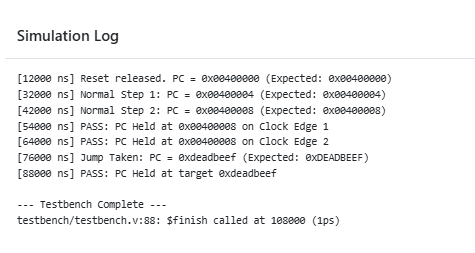

Six checks: reset value and PC+4, sequential counting across three clocks,
loading a jump target, resuming sequential execution from the new address,
holding when `PC_write` is low, and asynchronous reset mid-execution. The hold
test matters most — the multicycle FSM depends on the PC not advancing during
execute and memory states.

<details><summary><b>tb_ProgramCounter.v</b></summary>

```verilog
`timescale 1ns / 1ps

module testbench;

    // Inputs
    reg  [31:0] i_ALU_output;
    reg         PC_sel;
    reg         clk;
    reg         PC_write;
    reg         rst_n;

    // Outputs
    wire [31:0] o_PC_Output;
    wire [31:0] o_PC_Plus_4;

    // Instantiate Unit Under Test (UUT)
    ProgramCounter uut (
        .i_ALU_output(i_ALU_output),
        .PC_sel(PC_sel),
        .clk(clk),
        .PC_write(PC_write),
        .rst_n(rst_n),
        .o_PC_Output(o_PC_Output),
        .o_PC_Plus_4(o_PC_Plus_4)
    );

    // Clock generation: 100MHz (10ns period)
    always #5 clk = ~clk;

    initial begin
        // 1. Initialize Inputs
        clk          = 0;
        rst_n        = 0;
        PC_write     = 0;
        PC_sel       = 0;
        i_ALU_output = 32'h0040_1000;

        // 2. Apply Reset
        #12;
        rst_n = 1; // De-assert reset (sync with clock)
        $display("[%0t ns] Reset released. PC = 0x%h (Expected: 0x00400000)", $time, o_PC_Output);

        // 3. Normal Incrementing (PC_write = 1)
        #10;
        PC_write = 1;
        #10; // Clock edge updates PC to PC+4
        $display("[%0t ns] Normal Step 1: PC = 0x%h (Expected: 0x00400004)", $time, o_PC_Output);

        #10; // Clock edge updates PC to PC+8
        $display("[%0t ns] Normal Step 2: PC = 0x%h (Expected: 0x00400008)", $time, o_PC_Output);

        // 4. TEST HOLD / STALL BEHAVIOR (PC_write = 0)
        #2; // Change signal mid-cycle
        PC_write = 0;
        i_ALU_output = 32'hDEAD_BEEF; // Change inputs while stalled to verify immunity

        #10; // Rising edge 1 during stall
        if (o_PC_Output == 32'h0040_0008) 
            $display("[%0t ns] PASS: PC Held at 0x%h on Clock Edge 1", $time, o_PC_Output);
        else 
            $display("[%0t ns] FAIL: PC changed to 0x%h during stall!", $time, o_PC_Output);

        #10; // Rising edge 2 during stall
        if (o_PC_Output == 32'h0040_0008) 
            $display("[%0t ns] PASS: PC Held at 0x%h on Clock Edge 2", $time, o_PC_Output);
        else 
            $display("[%0t ns] FAIL: PC changed to 0x%h during stall!", $time, o_PC_Output);

        // 5. Resume Operation & Branch/Jump Test
        #2;
        PC_write = 1;
        PC_sel   = 1; // Take ALU output target

        #10; // Clock edge loads target
        $display("[%0t ns] Jump Taken: PC = 0x%h (Expected: 0xDEADBEEF)", $time, o_PC_Output);

        // 6. Test Hold after Jump
        #2;
        PC_write = 0;
        #10;
        if (o_PC_Output == 32'hDEAD_BEEF) 
            $display("[%0t ns] PASS: PC Held at target 0x%h", $time, o_PC_Output);
        else 
            $display("[%0t ns] FAIL: PC failed to hold target!", $time, o_PC_Output);

        #20;
        $display("\n--- Testbench Complete ---");
        $finish;
    end

endmodule

```

[Full source →](tb/tb_ProgramCounter.v)

</details>

---

## RegisterFile

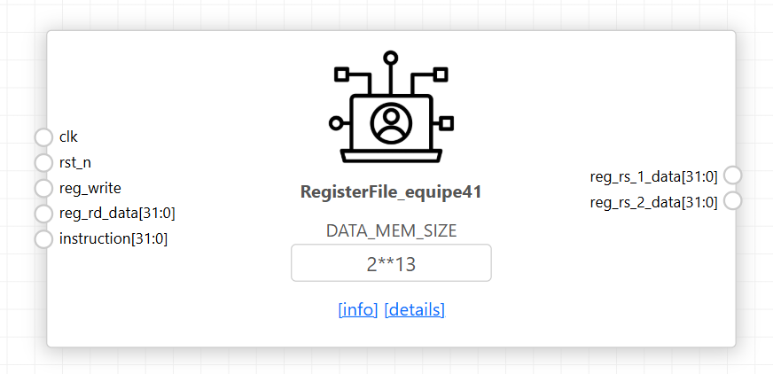

32 general-purpose 32-bit registers. Reads are asynchronous so both operands are
available in the decode state; writes are synchronous and gated by `reg_write`.
`x0` is protected on write and forced to zero on read, so it stays hardwired at
zero regardless of what any instruction targets. Reset initialises the global
pointer `x3` to `0x10010000` (DMEM base) and the stack pointer `x2` to the top
of the data region, `GP + DATA_MEM_SIZE − 4`.

<details><summary><b>RegisterFile.v</b></summary>

```verilog
module RegisterFile #(
    parameter DATA_MEM_SIZE = 2**13
)(
    input  wire        clk,
    input  wire        rst_n,
    input  wire        reg_write,
    input  wire [31:0] reg_rd_data,
    input  wire [31:0] instruction,
    output wire [31:0] reg_rs_1_data,
    output wire [31:0] reg_rs_2_data
);


    // Constants
    localparam SP_INDEX         = 5'd2;
    localparam GP_INDEX         = 5'd3;
    localparam GP_INITIAL_VALUE = 32'h1001_0000;
    localparam SP_INITIAL_VALUE = GP_INITIAL_VALUE + DATA_MEM_SIZE - 4;


    // Instruction field decoding
    wire [4:0] reg_rd_addr   = instruction[11:7];
    wire [4:0] reg_rs_1_addr = instruction[19:15];
    wire [4:0] reg_rs_2_addr = instruction[24:20];


    // 32 General-Purpose 32-bit Registers (x0 to x31)
    reg [31:0] regs [0:31];


    integer i;


    // --- SYNCHRONOUS WRITES & RESET ---
    always @(posedge clk or negedge rst_n) begin
        if (!rst_n) begin
            for (i = 0; i < 32; i = i + 1) begin
                case (i)
                    SP_INDEX: regs[i] <= SP_INITIAL_VALUE;
                    GP_INDEX: regs[i] <= GP_INITIAL_VALUE;
                    default:  regs[i] <= 32'h0000_0000;
                endcase
            end
        end else begin
            // Synchronous Write (x0 write protected)
            if (reg_write && (reg_rd_addr != 5'b00000)) begin
                regs[reg_rd_addr] <= reg_rd_data;
            end
        end
    end


    // --- ASYNCHRONOUS READS ---
    // General Purpose Register outputs (x0 strictly hardwired to 0)
    assign reg_rs_1_data = (reg_rs_1_addr == 5'b00000) ? 32'h0 : regs[reg_rs_1_addr];
    assign reg_rs_2_data = (reg_rs_2_addr == 5'b00000) ? 32'h0 : regs[reg_rs_2_addr];


endmodule
```

[Full source →](rtl/RegisterFile.v)

</details>

### Testbench

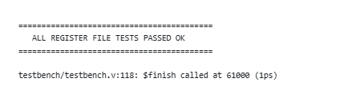

Verifies the reset values of `x2` and `x3`, write-then-read on general
registers, simultaneous read of two different registers, and the `x0`
protection — a write to `x0` is issued and the register is confirmed to still
read zero.

<details><summary><b>tb_RegisterFile.v</b></summary>

```verilog

`timescale 1ns / 1ps

module testbench;

    // Parameters
    localparam DATA_MEM_SIZE = 8192; // 8 KB

    // Testbench Signals
    reg         clk;
    reg         rst_n;
    reg         reg_write;
    reg  [31:0] reg_rd_data;
    reg  [31:0] instruction;
    wire [31:0] reg_rs_1_data;
    wire [31:0] reg_rs_2_data;

    // Instantiate Unit Under Test (UUT)
    RegisterFile #(
        .DATA_MEM_SIZE(DATA_MEM_SIZE)
    ) uut (
        .clk(clk),
        .rst_n(rst_n),
        .reg_write(reg_write),
        .reg_rd_data(reg_rd_data),
        .instruction(instruction),
        .reg_rs_1_data(reg_rs_1_data),
        .reg_rs_2_data(reg_rs_2_data)
    );

    // Clock Generation (100 MHz, 10ns period)
    always #5 clk = ~clk;

    // Task to construct standard RISC-V instruction fields cleanly
    task set_instruction;
        input [4:0] rs1;
        input [4:0] rs2;
        input [4:0] rd;
        begin
            instruction = 32'h0;
            instruction[19:15] = rs1;
            instruction[24:20] = rs2;
            instruction[11:7]  = rd;
        end
    endtask

    // Main Test Sequence
    initial begin
        // Signal Initialization
        clk = 0;
        rst_n = 0;
        reg_write = 0;
        reg_rd_data = 32'h0;
        instruction = 32'h0;

        // ----------------------------------------------------------------
        // Test 1: Assert Reset & Validate SP / GP / x0 Initialization
        // ----------------------------------------------------------------
        #20;
        rst_n = 1; // Release Reset cleanly
        #10;

        // Check x0 (rs1) and x2 / SP (rs2)
        set_instruction(5'd0, 5'd2, 5'd0); 
        #1;
        if (reg_rs_1_data !== 32'h0000_0000)
            $error("[FAIL] x0 initialization failed. Expected: 0x0, Got: 0x%h", reg_rs_1_data);
        if (reg_rs_2_data !== 32'h1001_1FFC) // 0x10010000 + 8192 - 4
            $error("[FAIL] SP (x2) reset failed. Expected: 0x10011FFC, Got: 0x%h", reg_rs_2_data);

        // Check x3 / GP (rs1) and general register x4 (rs2)
        set_instruction(5'd3, 5'd4, 5'd0); 
        #1;
        if (reg_rs_1_data !== 32'h1001_0000)
            $error("[FAIL] GP (x3) reset failed. Expected: 0x10010000, Got: 0x%h", reg_rs_1_data);
        if (reg_rs_2_data !== 32'h0000_0000)
            $error("[FAIL] x4 initialization failed. Expected: 0x0, Got: 0x%h", reg_rs_2_data);

        // ----------------------------------------------------------------
        // Test 2: Synchronous Write & Asynchronous Read (x5)
        // ----------------------------------------------------------------
        @(negedge clk);
        reg_write = 1'b1;
        reg_rd_data = 32'hDEAD_BEEF;
        set_instruction(5'd5, 5'd0, 5'd5); // Target rd = x5, Read rs1 = x5
        
        @(posedge clk); // Clock edge performs write
        #1;             // Allow asynchronous read output to update
        if (reg_rs_1_data !== 32'hDEAD_BEEF)
            $error("[FAIL] Register x5 write/read failed. Expected: 0xDEADBEEF, Got: 0x%h", reg_rs_1_data);

        // ----------------------------------------------------------------
        // Test 3: x0 Write Protection Test
        // ----------------------------------------------------------------
        @(negedge clk);
        reg_write = 1'b1;
        reg_rd_data = 32'hCAFE_BABE;
        set_instruction(5'd0, 5'd0, 5'd0); // Target rd = x0, Read rs1 = x0
        
        @(posedge clk); // Clock edge attempts write to x0
        #1;
        if (reg_rs_1_data !== 32'h0000_0000)
            $error("[FAIL] x0 protection failed! x0 modified to: 0x%h", reg_rs_1_data);

        // ----------------------------------------------------------------
        // Test 4: Dual Read Operations (Read x5 on rs1 and SP on rs2)
        // ----------------------------------------------------------------
        @(negedge clk);
        reg_write = 1'b0; // Disable write
        set_instruction(5'd5, 5'd2, 5'd0); // rs1 = x5, rs2 = x2
        #1;
        if (reg_rs_1_data !== 32'hDEAD_BEEF || reg_rs_2_data !== 32'h1001_1FFC)
            $error("[FAIL] Dual read failed. rs1: 0x%h, rs2: 0x%h", reg_rs_1_data, reg_rs_2_data);

        $display("\n==========================================");
        $display("   ALL REGISTER FILE TESTS PASSED OK      ");
        $display("==========================================\n");
        $finish;
    end

endmodule

```

[Full source →](tb/tb_RegisterFile.v)

</details>


---

## PC_Target_Align

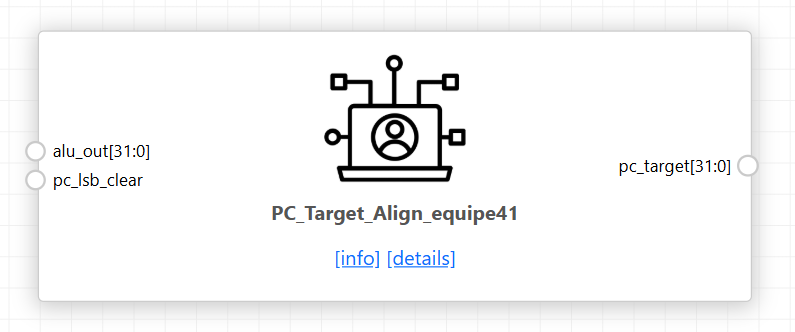

Clears bit 0 of the computed jump target when `pc_lsb_clear` is asserted, as the
RISC-V specification requires for JALR. Purely combinational; passes the
address through unchanged for every other instruction.

<details><summary><b>PC_Target_Align.v</b></summary>

```verilog
module PC_Target_Align (
    input  wire [31:0] alu_out,
    output wire [31:0] pc_target
);

assign pc_target = {alu_out[31:1], 1'b0};

endmodule
```

[Full source →](rtl/PC_Target_Align.v)
</details>

---

## ControlUnit

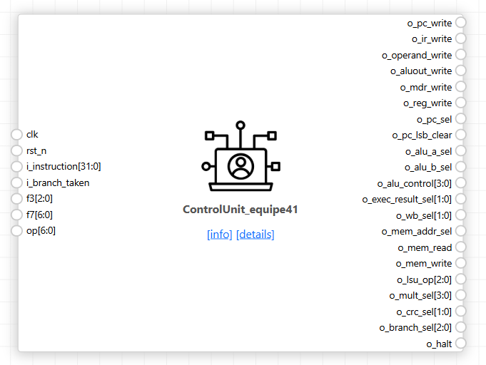

23-state Moore finite state machine sequencing every instruction through fetch,
decode, execute, memory and write-back. Decodes opcode, `funct3` and `funct7`
and validates the encoding: any combination that does not correspond to an
implemented instruction transitions to `ST_ILLEGAL`. Outputs depend on state
alone, so every datapath enable and multiplexer select is stable for the whole
cycle.

Instructions requiring no memory access skip the memory states, so cycle count
varies by instruction type. Loads take the longest path — address computation,
request, capture, write-back. `ECALL` and `EBREAK` enter `ST_HALT`, which
asserts `o_halt` and stops the machine, providing the termination signal used by
the validation testbench.

<details><summary><b>ControlUnit.v</b></summary>

```verilog
module ControlUnit(
    input wire          clk
  , input wire          rst_n
  , input wire [31:0]   i_instruction
  , input wire          i_branch_taken
  
  // sequential datapath enables

  , output reg          o_pc_write
  , output reg          o_ir_write  
  , output reg          o_operand_write
  , output reg          o_aluout_write
  , output reg          o_mdr_write 
  , output reg          o_reg_write

  // pc path

  , output reg          o_pc_sel        
  , output reg          o_pc_lsb_clear

  // alu controls

  , output reg          o_alu_a_sel
  , output reg          o_alu_b_sel
  , output reg [3:0]    o_alu_control

  // datapath mux controls including exec result
  , output reg [1:0]    o_exec_result_sel
  , output reg [1:0]    o_wb_sel
  , output reg          o_mem_addr_sel

  // mem/LSU controls
  , output reg          o_mem_read
  , output reg          o_mem_write
  , output reg [2:0]    o_lsu_op

  // mult/crc/branch controls
  , output reg [3:0]    o_mult_sel
  , output reg [1:0]    o_crc_sel
  , output reg [2:0]    o_branch_sel

  // extension/comparator controls
  , output reg          o_halt
//   , output reg          o_illegal
//   , output wire [5:0]   o_state
);

  reg o_illegal;
  wire [5:0] o_state;
  // 
  //  Instruction fields and opcodes    
  //

  wire [6:0] opcode = i_instruction[6:0];
  wire [2:0] funct3 = i_instruction[14:12];
  wire [6:0] funct7 = i_instruction[31:25];

   localparam [6:0] OP_LOAD = 7'b0000011;
   localparam [6:0] OP_FENCE  = 7'b0001111;
   localparam [6:0] OP_IMM    = 7'b0010011;
   localparam [6:0] OP_AUIPC  = 7'b0010111;
   localparam [6:0] OP_STORE  = 7'b0100011;
   localparam [6:0] OP_REG    = 7'b0110011;
   localparam [6:0] OP_LUI    = 7'b0110111;
   localparam [6:0] OP_BRANCH = 7'b1100011;
   localparam [6:0] OP_JALR   = 7'b1100111;
   localparam [6:0] OP_JAL    = 7'b1101111;
   localparam [6:0] OP_SYSTEM = 7'b1110011;

   // ALU encodings according to guide
    localparam [3:0] ALU_PASS_B = 4'h0;
    localparam [3:0] ALU_ADD    = 4'h1;
    localparam [3:0] ALU_SUB    = 4'h2;
    localparam [3:0] ALU_AND    = 4'h3;
    localparam [3:0] ALU_OR     = 4'h4;
    localparam [3:0] ALU_XOR    = 4'h5;
    localparam [3:0] ALU_SLL    = 4'h6;
    localparam [3:0] ALU_SRL    = 4'h7;
    localparam [3:0] ALU_SRA    = 4'h8;
    localparam [3:0] ALU_SLT    = 4'h9;
    localparam [3:0] ALU_SLTU   = 4'hA;

    localparam [1:0] EXEC_ALU = 2'b00;
    localparam [1:0] EXEC_MUL = 2'b01;
    localparam [1:0] EXEC_CRC = 2'b10;

    localparam [1:0] WB_ALUOUT = 2'b00;
    localparam [1:0] WB_MDR    = 2'b01;
    localparam [1:0] WB_PC4    = 2'b10;

   // LSU operation encoding, NOT SAME AS FUNCT3 for explicit mapping
    localparam [2:0] LSU_LW  = 3'b000;
    localparam [2:0] LSU_LH  = 3'b001;
    localparam [2:0] LSU_LB  = 3'b010;
    localparam [2:0] LSU_LHU = 3'b011;
    localparam [2:0] LSU_LBU = 3'b100;
    localparam [2:0] LSU_SW  = 3'b101;
    localparam [2:0] LSU_SH  = 3'b110;
    localparam [2:0] LSU_SB  = 3'b111;
 
  //
  // FSM STATES
  //

    localparam [5:0] ST_FETCH          = 6'd0;
    localparam [5:0] ST_DECODE         = 6'd1;
    localparam [5:0] ST_EXEC_REG       = 6'd2;
    localparam [5:0] ST_EXEC_IMM       = 6'd3;
    localparam [5:0] ST_EXEC_MUL       = 6'd4;
    localparam [5:0] ST_EXEC_CRC       = 6'd5;
    localparam [5:0] ST_EXEC_LUI       = 6'd6;
    localparam [5:0] ST_EXEC_AUIPC     = 6'd7;
    localparam [5:0] ST_EXEC_MEM_ADDR  = 6'd8;
    localparam [5:0] ST_LOAD_REQUEST   = 6'd9;
    localparam [5:0] ST_LOAD_CAPTURE   = 6'd10;
    localparam [5:0] ST_LOAD_WB        = 6'd11;
    localparam [5:0] ST_STORE_WRITE    = 6'd12;
    localparam [5:0] ST_BRANCH_TARGET  = 6'd13;
    localparam [5:0] ST_BRANCH_COMMIT  = 6'd14;
    localparam [5:0] ST_JAL_TARGET     = 6'd15;
    localparam [5:0] ST_JAL_COMMIT     = 6'd16;
    localparam [5:0] ST_JALR_TARGET    = 6'd17;
    localparam [5:0] ST_JALR_COMMIT    = 6'd18;
    localparam [5:0] ST_ALU_WB         = 6'd19;
    localparam [5:0] ST_FENCE_COMMIT   = 6'd20;
    localparam [5:0] ST_HALT           = 6'd21;
    localparam [5:0] ST_ILLEGAL        = 6'd22;

    reg [5:0] state_q;
    reg [5:0] state_d;

    assign o_state = state_q;
  
  // 
  // decode helpers
  //

    function valid_base_reg;
        input [2:0] f3;
        input [6:0] f7;
        begin
            if (f7 == 7'b0000000)
                valid_base_reg = 1'b1;
            else if ((f7 == 7'b0100000) &&
                     ((f3 == 3'b000) || (f3 == 3'b101)))
                valid_base_reg = 1'b1;
            else
                valid_base_reg = 1'b0;
        end
    endfunction

    function valid_imm;
        input [2:0] f3;
        input [6:0] f7;
        begin
            case (f3)
                3'b001: valid_imm = (f7 == 7'b0000000); // SLLI
                3'b101: valid_imm = (f7 == 7'b0000000) ||
                                    (f7 == 7'b0100000); // SRLI/SRAI
                default: valid_imm = 1'b1;
            endcase
        end
    endfunction 
    
    function valid_load;
        input [2:0] f3;
        begin
            valid_load = (f3 == 3'b000) || (f3 == 3'b001) ||
                         (f3 == 3'b010) || (f3 == 3'b100) ||
                         (f3 == 3'b101);
        end
    endfunction

    function valid_store;
        input [2:0] f3;
        begin
            valid_store = (f3 == 3'b000) || (f3 == 3'b001) ||
                          (f3 == 3'b010);
        end
    endfunction

    function valid_branch;
        input [2:0] f3;
        begin
            valid_branch = (f3 == 3'b000) || (f3 == 3'b001) ||
                           (f3 == 3'b100) || (f3 == 3'b101) ||
                           (f3 == 3'b110) || (f3 == 3'b111);
        end
    endfunction
    
    function [3:0] decode_base_alu;
        input [2:0] f3;
        input [6:0] f7;
        begin
            case (f3)
                3'b000: decode_base_alu = (f7 == 7'b0100000) ? ALU_SUB : ALU_ADD;
                3'b001: decode_base_alu = ALU_SLL;
                3'b010: decode_base_alu = ALU_SLT;
                3'b011: decode_base_alu = ALU_SLTU;
                3'b100: decode_base_alu = ALU_XOR;
                3'b101: decode_base_alu = (f7 == 7'b0100000) ? ALU_SRA : ALU_SRL;
                3'b110: decode_base_alu = ALU_OR;
                3'b111: decode_base_alu = ALU_AND;
                default: decode_base_alu = ALU_ADD;
            endcase
        end
    endfunction

    function [3:0] decode_imm_alu;
        input [2:0] f3;
        input [6:0] f7;
        begin
            case (f3)
                3'b000: decode_imm_alu = ALU_ADD;
                3'b001: decode_imm_alu = ALU_SLL;
                3'b010: decode_imm_alu = ALU_SLT;
                3'b011: decode_imm_alu = ALU_SLTU;
                3'b100: decode_imm_alu = ALU_XOR;
                3'b101: decode_imm_alu = (f7 == 7'b0100000) ? ALU_SRA : ALU_SRL;
                3'b110: decode_imm_alu = ALU_OR;
                3'b111: decode_imm_alu = ALU_AND;
                default: decode_imm_alu = ALU_ADD;
            endcase
        end
    endfunction

    function [2:0] decode_lsu;
        input [6:0] op;
        input [2:0] f3;
        begin
            if (op == OP_LOAD) begin
                case (f3)
                    3'b000: decode_lsu = LSU_LB;
                    3'b001: decode_lsu = LSU_LH;
                    3'b010: decode_lsu = LSU_LW;
                    3'b100: decode_lsu = LSU_LBU;
                    3'b101: decode_lsu = LSU_LHU;
                    default: decode_lsu = LSU_LW;
                endcase
            end else begin
                case (f3)
                    3'b000: decode_lsu = LSU_SB;
                    3'b001: decode_lsu = LSU_SH;
                    3'b010: decode_lsu = LSU_SW;
                    default: decode_lsu = LSU_SW;
                endcase
            end
        end
    endfunction

    //
    // state register
    // 

    always @(posedge clk or negedge rst_n) begin
        if (!rst_n)
            state_q <= ST_FETCH;
        else
            state_q <= state_d;
    end

    //
    // next state logic & instruction validation
    //

    always @(*) begin
        state_d = ST_ILLEGAL;

        case (state_q)
            ST_FETCH: state_d = ST_DECODE;

            ST_DECODE: begin
                case (opcode)
                    OP_REG: begin
                        if ((funct7 == 7'b0000001) && (funct3 <= 3'b011))
                            state_d = ST_EXEC_MUL;
                        else if ((funct7 == 7'b1000000) && (funct3 <= 3'b010))
                            state_d = ST_EXEC_CRC;
                        else if (valid_base_reg(funct3, funct7))
                            state_d = ST_EXEC_REG;
                        else
                            state_d = ST_ILLEGAL;
                    end

                    OP_IMM:
                        state_d = valid_imm(funct3, funct7) ? ST_EXEC_IMM : ST_ILLEGAL;

                    OP_LOAD:
                        state_d = valid_load(funct3) ? ST_EXEC_MEM_ADDR : ST_ILLEGAL;

                    OP_STORE:
                        state_d = valid_store(funct3) ? ST_EXEC_MEM_ADDR : ST_ILLEGAL;

                    OP_BRANCH:
                        state_d = valid_branch(funct3) ? ST_BRANCH_TARGET : ST_ILLEGAL;

                    OP_JALR:
                        state_d = (funct3 == 3'b000) ? ST_JALR_TARGET : ST_ILLEGAL;

                    OP_JAL:   state_d = ST_JAL_TARGET;
                    OP_LUI:   state_d = ST_EXEC_LUI;
                    OP_AUIPC: state_d = ST_EXEC_AUIPC;

                    OP_FENCE:
                        state_d = (funct3 == 3'b000) ? ST_FENCE_COMMIT : ST_ILLEGAL;

                    OP_SYSTEM: begin
                        // Ecall and Ebreak enters HALT state
                        if ((i_instruction == 32'h00000073) ||
                            (i_instruction == 32'h00100073))
                            state_d = ST_HALT;
                        else
                            state_d = ST_ILLEGAL;
                    end

                    default: state_d = ST_ILLEGAL;
                endcase
            end

            ST_EXEC_REG,
            ST_EXEC_IMM,
            ST_EXEC_MUL,
            ST_EXEC_CRC,
            ST_EXEC_LUI,
            ST_EXEC_AUIPC:    state_d = ST_ALU_WB;

            ST_EXEC_MEM_ADDR: state_d = (opcode == OP_LOAD) ?
                                       ST_LOAD_REQUEST : ST_STORE_WRITE;
            ST_LOAD_REQUEST:  state_d = ST_LOAD_CAPTURE;
            ST_LOAD_CAPTURE:  state_d = ST_LOAD_WB;
            ST_LOAD_WB:       state_d = ST_FETCH;
            ST_STORE_WRITE:   state_d = ST_FETCH;

            ST_BRANCH_TARGET: state_d = ST_BRANCH_COMMIT;
            ST_BRANCH_COMMIT: state_d = ST_FETCH;

            ST_JAL_TARGET:    state_d = ST_JAL_COMMIT;
            ST_JAL_COMMIT:    state_d = ST_FETCH;
            ST_JALR_TARGET:   state_d = ST_JALR_COMMIT;
            ST_JALR_COMMIT:   state_d = ST_FETCH;

            ST_ALU_WB:        state_d = ST_FETCH;
            ST_FENCE_COMMIT:  state_d = ST_FETCH;
            ST_HALT:          state_d = ST_HALT;
            ST_ILLEGAL:       state_d = ST_ILLEGAL;

            default:          state_d = ST_ILLEGAL;
        endcase
    end

    //
    // Moore output logic
    //

     always @(*) begin
        o_pc_write          = 1'b0;
        o_ir_write          = 1'b0;
        o_operand_write     = 1'b0;
        o_aluout_write      = 1'b0;
        o_mdr_write         = 1'b0;
        o_reg_write         = 1'b0;

        o_pc_sel            = 1'b0;
        o_pc_lsb_clear      = 1'b0;

        o_alu_a_sel         = 1'b0;
        o_alu_b_sel         = 1'b0;
        o_alu_control       = ALU_ADD;

        o_exec_result_sel   = EXEC_ALU;
        o_wb_sel            = WB_ALUOUT;
        o_mem_addr_sel      = 1'b0;

        o_mem_read          = 1'b0;
        o_mem_write         = 1'b0;
        o_lsu_op            = LSU_LW;

        o_mult_sel           = 4'h0;
        o_crc_sel            = 2'b00;
        o_branch_sel         = funct3;

        o_halt               = 1'b0;
        o_illegal            = 1'b0;

        case (state_q)
        ST_FETCH: begin
            o_mem_addr_sel = 1'b0;       // current PC
            o_mem_read     = 1'b1;
            o_lsu_op       = LSU_LW;     // pass complete IMEM word
            o_ir_write     = 1'b1;
        end

        ST_DECODE: begin
        o_operand_write = 1'b1;      // capture both rs1 and rs2
        end

        ST_EXEC_REG: begin
            o_alu_a_sel       = 1'b0;
            o_alu_b_sel       = 1'b0;
            o_alu_control     = decode_base_alu(funct3, funct7);
            o_exec_result_sel = EXEC_ALU;
            o_aluout_write    = 1'b1;
        end

        ST_EXEC_IMM: begin
            o_alu_a_sel       = 1'b0;
            o_alu_b_sel       = 1'b1;
            o_alu_control     = decode_imm_alu(funct3, funct7);
            o_exec_result_sel = EXEC_ALU;
            o_aluout_write    = 1'b1;
        end

        ST_EXEC_MUL: begin
            o_mult_sel        = {1'b0, funct3};
            o_exec_result_sel = EXEC_MUL;
            o_aluout_write    = 1'b1;
        end

        ST_EXEC_CRC: begin
            o_crc_sel         = funct3[1:0];
            o_exec_result_sel = EXEC_CRC;
            o_aluout_write    = 1'b1;
        end

        ST_EXEC_LUI: begin
            o_alu_b_sel       = 1'b1;
            o_alu_control     = ALU_PASS_B;
            o_exec_result_sel = EXEC_ALU;
            o_aluout_write    = 1'b1;
        end

        ST_EXEC_AUIPC: begin
            o_alu_a_sel       = 1'b1;    // current instruction PC
            o_alu_b_sel       = 1'b1;    // U-immediate
            o_alu_control     = ALU_ADD;
            o_exec_result_sel = EXEC_ALU;
            o_aluout_write    = 1'b1;
        end

        ST_EXEC_MEM_ADDR: begin
            o_alu_a_sel       = 1'b0;    // rs1
            o_alu_b_sel       = 1'b1;    // load/store immediate
            o_alu_control     = ALU_ADD;
            o_exec_result_sel = EXEC_ALU;
            o_aluout_write    = 1'b1;
        end

        ST_LOAD_REQUEST: begin
            o_mem_addr_sel = 1'b1;       // ALUOut effective addr
            o_mem_read     = 1'b1;
            o_lsu_op       = decode_lsu(opcode, funct3);
        end

        ST_LOAD_CAPTURE: begin
            o_mem_addr_sel = 1'b1;
            o_mem_read     = 1'b1;
            o_lsu_op       = decode_lsu(opcode, funct3);
            o_mdr_write    = 1'b1;
        end

        ST_LOAD_WB: begin
            o_wb_sel    = WB_MDR;
            o_reg_write = 1'b1;
            o_pc_sel    = 1'b0;
            o_pc_write  = 1'b1;
        end

        ST_STORE_WRITE: begin
            o_mem_addr_sel = 1'b1;
            o_mem_write    = 1'b1;
            o_lsu_op       = decode_lsu(opcode, funct3);
            o_pc_sel       = 1'b0;
            o_pc_write     = 1'b1;
        end

        ST_BRANCH_TARGET: begin
            o_alu_a_sel       = 1'b1;    // current PC
            o_alu_b_sel       = 1'b1;    // B-immediate
            o_alu_control     = ALU_ADD;
            o_exec_result_sel = EXEC_ALU;
            o_aluout_write    = 1'b1;
            o_branch_sel      = funct3;
        end

        ST_BRANCH_COMMIT: begin
            o_branch_sel = funct3;
            o_pc_sel     = i_branch_taken;
            o_pc_write   = 1'b1;         // target or sequential PC+4
        end

        ST_JAL_TARGET: begin
            o_alu_a_sel       = 1'b1;    // current PC
            o_alu_b_sel       = 1'b1;    // J-immediate
            o_alu_control     = ALU_ADD;
            o_exec_result_sel = EXEC_ALU;
            o_aluout_write    = 1'b1;
        end

        ST_JAL_COMMIT: begin
            o_wb_sel    = WB_PC4;
            o_reg_write = 1'b1;
            o_pc_sel    = 1'b1;
            o_pc_write  = 1'b1;
        end

        ST_JALR_TARGET: begin
            o_alu_a_sel       = 1'b0;    // rs1
            o_alu_b_sel       = 1'b1;    // I-immediate
            o_alu_control     = ALU_ADD;
            o_exec_result_sel = EXEC_ALU;
            o_aluout_write    = 1'b1;
        end

        ST_JALR_COMMIT: begin
            o_wb_sel       = WB_PC4;
            o_reg_write    = 1'b1;
            o_pc_sel       = 1'b1;
            o_pc_lsb_clear = 1'b1;
            o_pc_write     = 1'b1;
        end

        ST_ALU_WB: begin
            o_wb_sel    = WB_ALUOUT;
            o_reg_write = 1'b1;
            o_pc_sel    = 1'b0;
            o_pc_write  = 1'b1;
        end

        ST_FENCE_COMMIT: begin
            o_pc_sel   = 1'b0;
            o_pc_write = 1'b1;
        end

        ST_HALT: begin
            o_halt = 1'b1;
        end

        ST_ILLEGAL: begin
            o_illegal = 1'b1;
            o_halt    = 1'b1;
        end

        default: begin
            o_illegal = 1'b1;
            o_halt    = 1'b1;
        end
    endcase
  end
endmodule
 
 
`default_nettype wire
```

[Full source →](rtl/ControlUnit.v)

</details>
---

## Datapath registers

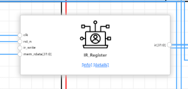
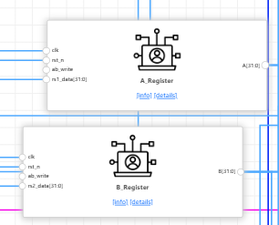
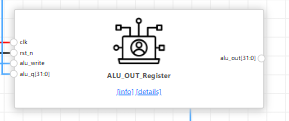
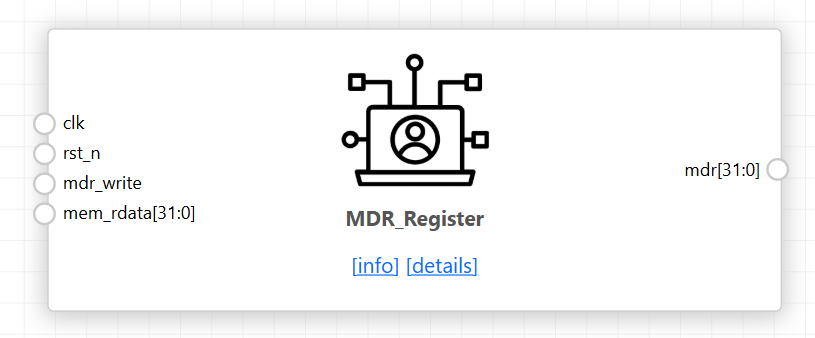

Five enable-gated 32-bit registers hold intermediate values between states. All
share the same structure: asynchronous active-low reset to zero, and a
synchronous load gated by a control-unit enable.

| Register | Enable | Holds |
|---|---|---|
| `IR_Register` | `o_ir_write` | fetched instruction, stable for the whole instruction |
| `A_Register` | `o_operand_write` | `rs1` read from the register file |
| `B_Register` | `o_operand_write` | `rs2` read from the register file |
| `ALU_OUT_Register` | `o_aluout_write` | execution result or computed address |
| `MDR_Register` | `o_mdr_write` | word returned by a load |

<details><summary><b>IR_Registers.v</b></summary>

```verilog
module IR_Register (
    input  wire        clk,
    input  wire        rst_n,
    input  wire        ir_write,
    input  wire [31:0] mem_rdata,
    output reg  [31:0] ir
);

always @(posedge clk or negedge rst_n) begin
    if (!rst_n)
        ir <= 32'h00000000;
    else if (ir_write)
        ir <= mem_rdata;
end

endmodule
```

[Full source →](rtl/IR_Registers.v)

</details>
<details><summary><b>A_Registers.v</b></summary>

```verilog
module A_Register (
    input  wire        clk,
    input  wire        rst_n,
    input  wire        ab_write,
    input  wire [31:0] rs1_data,
    output reg  [31:0] A
);

always @(posedge clk or negedge rst_n) begin
    if (!rst_n)
        A <= 32'h00000000;
    else if (ab_write)
        A <= rs1_data;
end

endmodule
```

[Full source →](rtl/A_Registers.v)

</details>
<details><summary><b>B_Registers.v</b></summary>

```verilog
module B_Register (
    input  wire        clk,
    input  wire        rst_n,
    input  wire        ab_write,
    input  wire [31:0] rs2_data,
    output reg  [31:0] B
);

always @(posedge clk or negedge rst_n) begin
    if (!rst_n)
        B <= 32'h00000000;
    else if (ab_write)
        B <= rs2_data;
end

endmodule
```

[Full source →](rtl/B_Registers.v)

</details>
<details><summary><b>ALU_OUT_Registers.v</b></summary>

```verilog
module ALU_OUT_Register (
    input  wire        clk,
    input  wire        rst_n,
    input  wire        alu_write,
    input  wire [31:0] alu_q,
    output reg  [31:0] alu_out
);

always @(posedge clk or negedge rst_n) begin
    if (!rst_n)
        alu_out <= 32'h00000000;
    else if (alu_write)
        alu_out <= alu_q;
end

endmodule
```

[Full source →](rtl/ALU_OUT_Registers.v)

</details>
<details><summary><b>MDR_Registers.v</b></summary>

```verilog
module MDR_Register (
    input  wire        clk,
    input  wire        rst_n,
    input  wire        mdr_write,
    input  wire [31:0] mem_rdata,
    output reg  [31:0] mdr
);

always @(posedge clk or negedge rst_n) begin
    if (!rst_n)
        mdr <= 32'h00000000;
    else if (mdr_write)
        mdr <= mem_rdata;
end

endmodule
```

[Full source →](rtl/MDR_Registers.v)

</details>
---

## Multiplexers

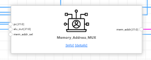
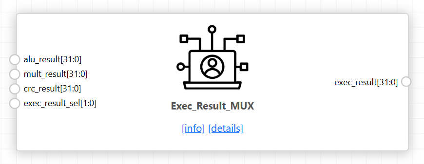
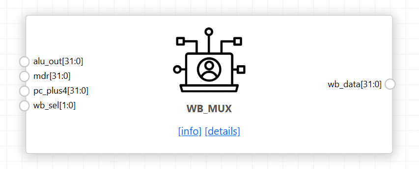

Three combinational multiplexers steer the datapath under control-unit select
lines.

| Mux | Select | Sources |
|---|---|---|
| `Memory_Address_MUX` | `o_mem_addr_sel` | PC (fetch) or ALU output (effective address) |
| `Exec_Result_MUX` | `o_exec_result_sel` | ALU, Multiplier or CRC result |
| `WB_MUX` | `o_wb_sel` | ALU output, memory data register, or PC+4 for JAL/JALR |

Each has a `default` branch returning zero so no latch is inferred.

<details><summary><b>Memory_Address_MUX.v</b></summary>

```verilog
module Memory_Address_MUX (
    input  wire [31:0] pc,
    input  wire [31:0] alu_out,
    input  wire        mem_addr_sel,
    output wire [31:0] mem_addr
);

assign mem_addr = mem_addr_sel ? alu_out : pc;

endmodule
```
[Full source →](rtl/Memory_Address_MUX.v)
</details>
<details><summary><b>Exec_Result_MUX.v</b></summary>

```verilog
`timescale 1ns / 1ps
module Exec_Result_MUX (
    input  wire [31:0] alu_result,
    input  wire [31:0] mult_result,
    input  wire [31:0] crc_result,
    input  wire [1:0]  exec_result_sel,

    output reg  [31:0] exec_result
);

always @(*) begin
    case (exec_result_sel)
        2'b00: exec_result = alu_result;
        2'b01: exec_result = mult_result;
        2'b10: exec_result = crc_result;
        default: exec_result = 32'h00000000;
    endcase
end

endmodule
```
[Full source →](rtl/Exec_Result_MUX.v)
</details>
<details><summary><b>WB_MUX.v</b></summary>

```verilog
module WB_MUX (
    input  wire [31:0] alu_out,
    input  wire [31:0] mdr,
    input  wire [31:0] mult_result,
    input  wire [31:0] crc_result,
    input  wire [31:0] pc_plus4,
    input  wire [2:0]  wb_sel,

    output reg  [31:0] wb_data
);

always @(*) begin
    case (wb_sel)
        3'd0: wb_data = alu_out;
        3'd1: wb_data = mdr;
        3'd2: wb_data = mult_result;
        3'd3: wb_data = crc_result;
        3'd4: wb_data = pc_plus4;
        default: wb_data = 32'h00000000;
    endcase
end

endmodule
```
[Full source →](rtl/WB_MUX.v)
</details>
---

## Physical implementation

| Metric | Value |
|---|---|
| Technology | SkyWater 130 nm, `sky130_fd_sc_hd` |
| Clock period | _fill in_ |
| Die area | _fill in_ mm² |
| Final utilisation | _fill in_ % |
| Total cells | _fill in_ |
| Magic DRC / KLayout DRC / LVS | 0 / 0 / 0 |


[OpenLane config →](synthesis/config.json)

## Firmware validation
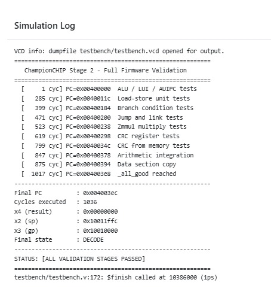

`x4 = 0` at the terminating self-loop confirms every validation stage completed
without reaching `_error`.


[Firmware →](firmware.hex)
