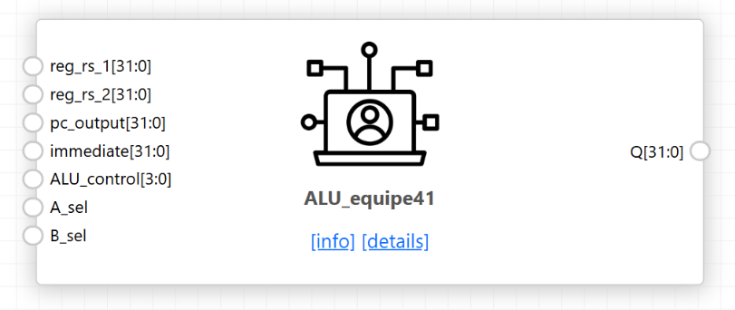

# RISCV32-ChampionChip — Team 41

32-bit multicycle RISC-V processor (RV32I + Zmmul + Xicrc), designed in
ChipInventor and hardened with OpenLane on SkyWater 130 nm.

**ISA coverage 47/47 (100%)** · **Firmware validation: all stages PASSED**

```
rtl/        module sources
tb/         testbenches
docs/img/   block diagrams and simulation logs
synthesis/  OpenLane config and flattened source
results/    GDSII, gate-level netlist, metrics
```

### Contents

[ALU](#alu) · [BranchComparator](#branchcomparator) · [Multiplier](#multiplier) ·
[CRC](#crc) · [ImmediateGenerator](#immediategenerator) ·
[MemoryUnit](#memoryunit) · [ProgramCounter](#programcounter) ·
[PC_Target_Align](#pc_target_align) · [RegisterFile](#registerfile) ·
[ControlUnit](#controlunit) · [Datapath registers](#datapath-registers) ·
[Multiplexers](#multiplexers)

---

## ALU



Eleven operations selected by a 4-bit code formed from `funct7[25]` and
`funct3[14:12]`. Two input multiplexers let one ALU serve register operations,
immediate operations and PC-relative address computation: `A_sel` picks
`reg_rs_1` or `pc_output`, `B_sel` picks `reg_rs_2` or `immediate`.

| Code | Op | | Code | Op |
|---|---|---|---|---|
| `0` | PASS_B (LUI) | | `6` | SLL |
| `1` | ADD | | `7` | SRL |
| `2` | SUB | | `8` | MRS (arithmetic `>>>`) |
| `3` | AND | | `9` | SLT (signed) |
| `4` | OR | | `A` | SLTU (`$unsigned`) |
| `5` | XOR | | | |

<details><summary><b>rtl/ALU.v</b></summary>

```verilog
// paste module here
```
</details>

### Testbench


Drives all eleven operations and prints both multiplexer outputs alongside the
result. Directed operands isolate the sign-sensitive paths: `0x8000000F`
shifted right by 4 separates SRL (`0x08000000`) from MRS (`0xF8000000`), and
`-2` against `+10` separates SLT (returns 1) from SLTU (returns 0).

<details><summary><b>tb/tb_ALU.v</b></summary>

```verilog
// paste testbench here
```
</details>

---

## BranchComparator


Evaluates the six RV32I branch conditions from `funct3`, driving
`o_Branch_Taken` for the control unit's branch commit state. Three comparisons
are computed in parallel — equality, signed less-than, and unsigned less-than
via `$unsigned` casts — and the six conditions are formed from those by
selection and inversion.

| `funct3` | Branch | Condition |
|---|---|---|
| `000` | BEQ | equal |
| `001` | BNE | not equal |
| `100` | BLT | signed less-than |
| `101` | BGE | not signed less-than |
| `110` | BLTU | unsigned less-than |
| `111` | BGEU | not unsigned less-than |

<details><summary><b>rtl/BranchComparator.v</b></summary>

```verilog
// paste module here
```
</details>

### Testbench


Checks each condition true and false. The decisive cases use operand pairs
where signed and unsigned interpretation disagree — `0x7FFFFFFF` against
`0x80000000` is signed greater-than but unsigned less-than, so BLT and BLTU
must return opposite results on identical inputs.

<details><summary><b>tb/tb_BranchComparator.v</b></summary>

```verilog
// paste testbench here
```
</details>

---

## Multiplier


Covers the four Zmmul instructions. Three 64-bit products are computed —
signed×signed, signed×unsigned and unsigned×unsigned — and `mult_sel`, taken
from `funct3`, selects which half of which product reaches `rd`. MUL returns
the low 32 bits, which are identical regardless of signedness; the three MULH
variants return the upper 32 bits of the matching product.

| `mult_sel` | Instruction | Output |
|---|---|---|
| `0` | MUL | `mul_ss[31:0]` |
| `1` | MULH | `mul_ss[63:32]` |
| `2` | MULHSU | `mul_su[63:32]` |
| `3` | MULHU | `mul_uu[63:32]` |

<details><summary><b>rtl/Multiplier.v</b></summary>

```verilog
// paste module here
```
</details>

### Testbench


Stresses the upper and lower halves of the product with operands whose signed
and unsigned interpretations differ. `0xFFFFFFFB` against `0x0000000A` gives
`0xFFFFFFCE` for MUL and `0xFFFFFFFF` for MULH, but `0x00000009` for MULHU —
the same input bits, three different results.

<details><summary><b>tb/tb_Multiplier.v</b></summary>

```verilog
// paste testbench here
```
</details>

---

## CRC


CRC-16/IBM-3740 over byte, halfword or word payloads: polynomial `0x1021`,
seed from `reg_rs_2[15:0]`, no input or output reflection, no final XOR. Three
`crc_calc` instances run in parallel and `crc_sel` picks the width. The result
is zero-extended to 32 bits and can be fed straight back into the seed to chain
across a longer message. Because `REF_IN = 0` the payload is consumed MSB
first, so a word payload `0x34333231` is the byte sequence `34 33 32 31`.

<details><summary><b>rtl/CRC.v</b></summary>

```verilog
// paste module here (CRC and crc_calc)
```
</details>

### Testbench


Checks each width against independently computed CRC-16/IBM-3740 values, plus
the undefined-selector fallback. `reg_rs_2` carries a non-zero upper half to
confirm only bits `[15:0]` are used as the seed.

| `crc_sel` | Payload | Result |
|---|---|---|
| `00` | `0x31` | `0x0000C782` |
| `01` | `0x3231` | `0x0000588A` |
| `10` | `0x34333231` | `0x0000BBA8` |
| `11` | — | `0x00000000` |

<details><summary><b>tb/tb_CRC.v</b></summary>

```verilog
// paste testbench here
```
</details>

---

## ImmediateGenerator


Extracts and sign-extends the immediate field for every RISC-V format, choosing
by opcode. B and J formats reassemble scattered instruction bits and append an
implicit zero, giving the 2-byte alignment branches and jumps require. U format
is not sign-extended — the 20-bit field is placed in the upper bits with zeros
below.

| Opcode | Format | Source bits |
|---|---|---|
| `1101111` JAL | J | `[31]`, `[19:12]`, `[20]`, `[30:25]`, `[24:21]`, `0` |
| `1100011` BRANCH | B | `[31]`, `[7]`, `[30:25]`, `[11:8]`, `0` |
| `0100011` STORE | S | `[31:25]`, `[11:7]` |
| `0110111` / `0010111` LUI, AUIPC | U | `[31:12]`, 12 zeros |
| all others | I | `[31:20]` |

<details><summary><b>rtl/ImmediateGenerator.v</b></summary>

```verilog
// paste module here
```
</details>

### Testbench


Feeds one instruction per format and compares against the hand-decoded
immediate. Negative offsets confirm sign extension; B and J cases confirm bit 0
is always zero and that the scattered fields are reassembled in the right
order.

<details><summary><b>tb/tb_ImmediateGenerator.v</b></summary>

```verilog
// paste testbench here
```
</details>

---

## MemoryUnit


Wraps the load-store unit, address decoder, instruction memory and data memory
behind one interface. IMEM reads asynchronously and DMEM synchronously, so the
decoder select is registered and the read multiplexer picks the DMEM word one
cycle late while routing IMEM combinationally.

Four submodules:

- **LSU** — sign or zero extends loads (LB, LH, LBU, LHU), lane-shifts store
  data, and generates the 4-bit byte-write mask for SB, SH and SW
- **AddressDecoder** — routes by range and rebases: `0x00400000` → IMEM,
  `0x10010000` → DMEM, each mapped to zero before the memory sees it
- **IMEM** — instruction memory, asynchronous read, firmware held in decode
  logic rather than `$readmemh` so no external file is required
- **DMEM** — four byte-wide arrays sharing one word index, so a byte or
  halfword write updates only the selected lanes

<details><summary><b>rtl/MemoryUnit.v</b></summary>

```verilog
// paste module here (MemoryUnit, LSU, AddressDecoder, IMEM, DMEM)
```
</details>

### Testbench


44 tests in six categories: every byte lane and both halfword lanes with sign
and zero extension, sub-word partial overwrite, mixed async/sync latency
arbitration, address-decoder boundaries and unmapped access, and 20 randomised
store/load pairs. The partial-overwrite category is the sharpest check — a word
is written, then a byte and a halfword overwrite parts of it, and the word is
re-read to confirm the untouched lanes survived. **44/44 passed.**

<details><summary><b>tb/tb_MemoryUnit.v</b></summary>

```verilog
// paste testbench here
```
</details>

---

## ProgramCounter


Holds the program counter and computes PC+4. `PC_sel` chooses between the
sequential address and the branch or jump target; `PC_write` gates the update
so the PC holds steady across the several cycles of one multicycle instruction.
Reset is asynchronous and loads `0x00400000`, the firmware load address.

<details><summary><b>rtl/ProgramCounter.v</b></summary>

```verilog
// paste module here
```
</details>

### Testbench


Six checks: reset value and PC+4, sequential counting across three clocks,
loading a jump target, resuming sequential execution from the new address,
holding when `PC_write` is low, and asynchronous reset mid-execution. The hold
test matters most — the multicycle FSM depends on the PC not advancing during
execute and memory states.

<details><summary><b>tb/tb_ProgramCounter.v</b></summary>

```verilog
// paste testbench here
```
</details>

---

## PC_Target_Align


Clears bit 0 of the computed jump target when `pc_lsb_clear` is asserted, as the
RISC-V specification requires for JALR. Purely combinational; passes the
address through unchanged for every other instruction.

<details><summary><b>rtl/PC_Target_Align.v</b></summary>

```verilog
// paste module here
```
</details>

### Testbench


Applies odd and even targets with the control both asserted and de-asserted,
confirming bit 0 is cleared only for JALR and that no other bit is disturbed.

<details><summary><b>tb/tb_PC_Target_Align.v</b></summary>

```verilog
// paste testbench here
```
</details>

---

## RegisterFile


32 general-purpose 32-bit registers. Reads are asynchronous so both operands are
available in the decode state; writes are synchronous and gated by `reg_write`.
`x0` is protected on write and forced to zero on read, so it stays hardwired at
zero regardless of what any instruction targets. Reset initialises the global
pointer `x3` to `0x10010000` (DMEM base) and the stack pointer `x2` to the top
of the data region, `GP + DATA_MEM_SIZE − 4`.

<details><summary><b>rtl/RegisterFile.v</b></summary>

```verilog
// paste module here
```
</details>

### Testbench


Verifies the reset values of `x2` and `x3`, write-then-read on general
registers, simultaneous read of two different registers, and the `x0`
protection — a write to `x0` is issued and the register is confirmed to still
read zero.

<details><summary><b>tb/tb_RegisterFile.v</b></summary>

```verilog
// paste testbench here
```
</details>

---

## ControlUnit


23-state Moore finite state machine sequencing every instruction through fetch,
decode, execute, memory and write-back. Decodes opcode, `funct3` and `funct7`
and validates the encoding: any combination that does not correspond to an
implemented instruction transitions to `ST_ILLEGAL`. Outputs depend on state
alone, so every datapath enable and multiplexer select is stable for the whole
cycle.

Instructions requiring no memory access skip the memory states, so cycle count
varies by instruction type. Loads take the longest path — address computation,
request, capture, write-back. `ECALL` and `EBREAK` enter `ST_HALT`, which
asserts `o_halt` and stops the machine, providing the termination signal used by
the validation testbench.

<details><summary><b>rtl/ControlUnit.v</b></summary>

```verilog
// paste module here
```
</details>

### Testbench


Feeds one instruction per class and follows the state sequence, checking that
each state asserts the expected enables and selects. Illegal encodings — a
reserved `funct7` on a shift-immediate, an unassigned branch `funct3` — are
applied to confirm the FSM reaches `ST_ILLEGAL` rather than executing something.

<details><summary><b>tb/tb_ControlUnit.v</b></summary>

```verilog
// paste testbench here
```
</details>

---

## Datapath registers


Five enable-gated 32-bit registers hold intermediate values between states. All
share the same structure: asynchronous active-low reset to zero, and a
synchronous load gated by a control-unit enable.

| Register | Enable | Holds |
|---|---|---|
| `IR_Register` | `o_ir_write` | fetched instruction, stable for the whole instruction |
| `A_Register` | `o_operand_write` | `rs1` read from the register file |
| `B_Register` | `o_operand_write` | `rs2` read from the register file |
| `ALU_OUT_Register` | `o_aluout_write` | execution result or computed address |
| `MDR_Register` | `o_mdr_write` | word returned by a load |

<details><summary><b>rtl/Registers.v</b></summary>

```verilog
// paste modules here
```
</details>

### Testbench


For each register: reset clears it, an enabled clock edge loads the input, and a
clock edge with the enable low leaves it unchanged. The hold case is the one
that matters — these registers exist so a value survives while later states use
it.

<details><summary><b>tb/tb_Registers.v</b></summary>

```verilog
// paste testbench here
```
</details>

---

## Multiplexers


Three combinational multiplexers steer the datapath under control-unit select
lines.

| Mux | Select | Sources |
|---|---|---|
| `Memory_Address_MUX` | `o_mem_addr_sel` | PC (fetch) or ALU output (effective address) |
| `Exec_Result_MUX` | `o_exec_result_sel` | ALU, Multiplier or CRC result |
| `WB_MUX` | `o_wb_sel` | ALU output, memory data register, or PC+4 for JAL/JALR |

Each has a `default` branch returning zero so no latch is inferred.

<details><summary><b>rtl/Muxes.v</b></summary>

```verilog
// paste modules here
```
</details>

### Testbench


Drives distinct values on each input and sweeps the select line through every
encoding including the undefined one, confirming the correct source is passed
and that the unused encoding returns zero.

<details><summary><b>tb/tb_Muxes.v</b></summary>

```verilog
// paste testbench here
```
</details>

---

## Physical implementation

| Metric | Value |
|---|---|
| Technology | SkyWater 130 nm, `sky130_fd_sc_hd` |
| Clock period | _fill in_ |
| Die area | _fill in_ mm² |
| Final utilisation | _fill in_ % |
| Total cells | _fill in_ |
| Magic DRC / KLayout DRC / LVS | 0 / 0 / 0 |


## Firmware validation

```
stopped at PC=004003ec after 1036 cycles, x4=00000000
==== PASSED ====
```

`x4 = 0` at the terminating self-loop confirms every validation stage completed
without reaching `_error`.


