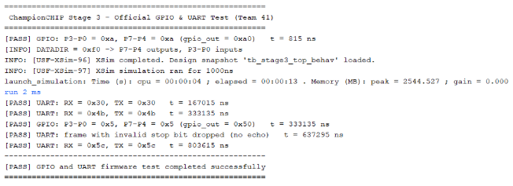
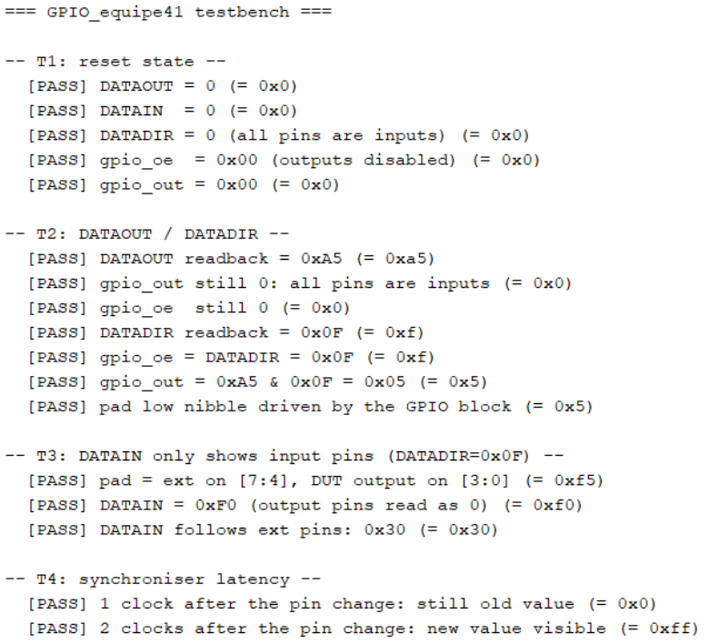
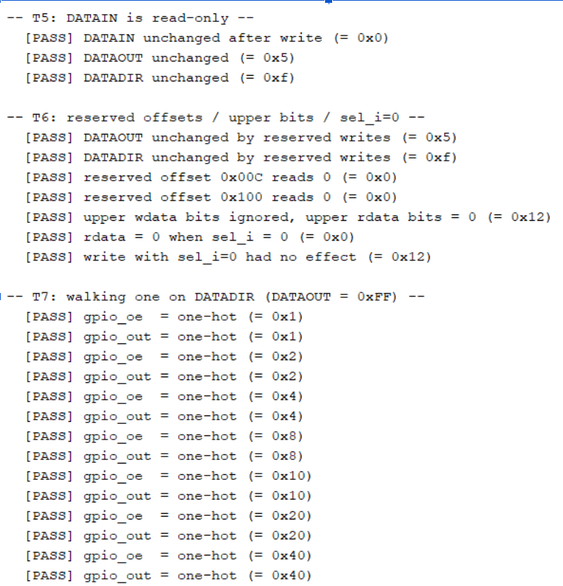
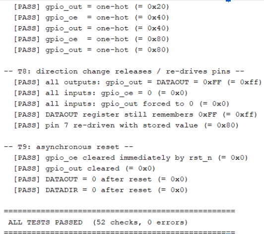
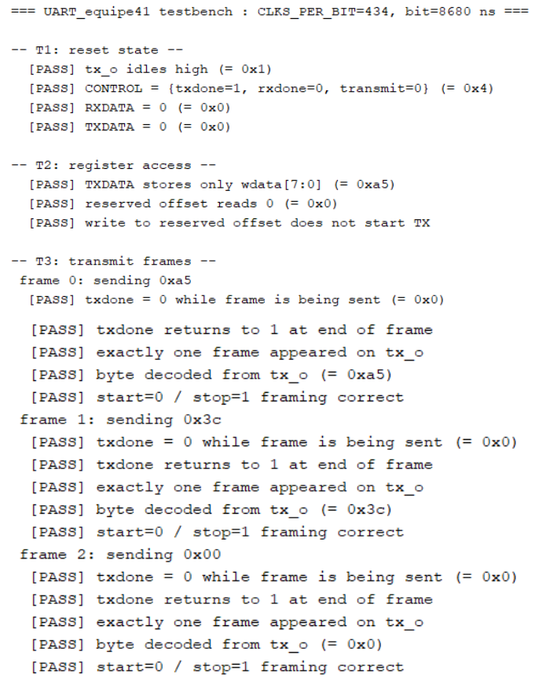
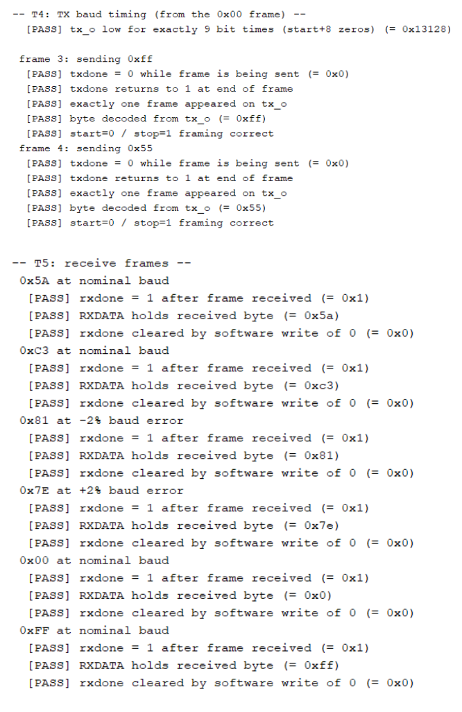
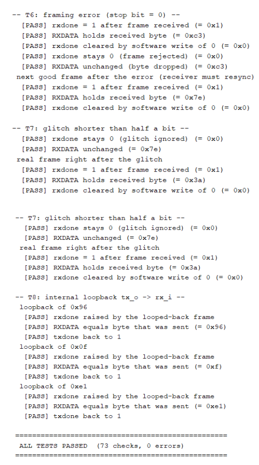
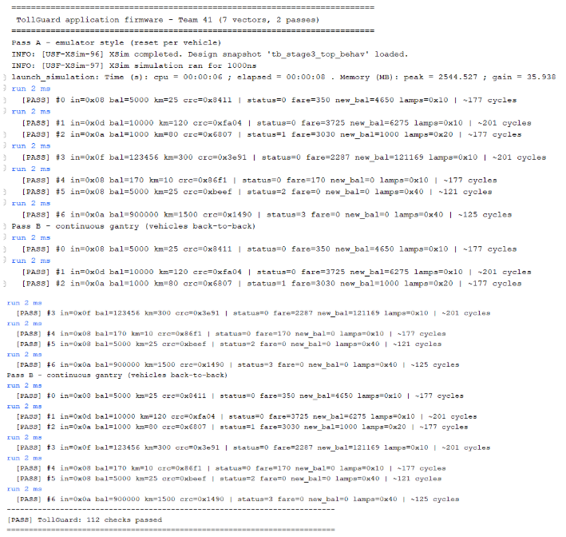

# TollGuard — RISC-V SoC with GPIO & UART
### ChampionCHIP eXperience Malaysia Edition · Stage 3 · Team 41 (Equipe 41)

TollGuard is an electronic highway toll-gantry controller built on our Stage 2
**RV32I multicycle core with Zmmul (hardware multiplier) and Xicrc (custom CRC-16
instruction)**. In Stage 3 the core gains two memory-mapped peripherals, **GPIO** and
**UART**. The firmware:

1. reads roadside sensors on GPIO;
2. receives the vehicle's tag data over UART;
3. checks the data with the custom `CRCB` instruction;
4. computes the toll with `MUL` / `MULHU`;
5. opens the gate or raises an alarm on GPIO, and sends a receipt back over UART.

| Result | Status | Evidence |
|---|---|---|
| Official GPIO & UART test firmware | **PASS** | [Section 3](#3-official-firmware-testbench) |
| GPIO block unit testbench | **PASS — 52 checks, 0 errors** | [Section 3.1](#31-gpio-and-uart-block-testbenches) |
| UART block unit testbench | **PASS — 73 checks, 0 errors** | [Section 3.1](#31-gpio-and-uart-block-testbenches) |
| TollGuard application testbench | **PASS — 112 checks** (7 scenarios × 2 passes) | [Section 5](#5-tollguard-application-testbench) |

All evidence below is shown as screenshots of the Vivado XSim console. The image files are in [`testbench/pic/`](testbench/pic).

---

## 1. Repository structure

```
rtl/
  hdl.v                              Complete SoC exported from ChipInventor (top: stage3_top_old)
                                     - Stage 2 core blocks (ALU, CRC, Multiplier, Control Unit, ...)
                                     - GPIO_equipe41, UART_equipe41
                                     - MemoryUnit_SoC_equipe41 (LSU + address decoder + IMEM + DMEM)
                                     - IMEM = TollGuard application firmware
  hdl_OFFICIAL_TEST_FW.v             Same design; IMEM = official GPIO/UART test firmware
firmware/
  OFFICIAL_TEST_FW_main.s            Organisers' GPIO/UART test firmware (assembly)
  OFFICIAL_TEST_FW_firmware.bin      ... binary (21 words)
  TOLLGUARD_APP_FW_main.s            TollGuard application firmware (assembly)
  TOLLGUARD_APP_FW_firmware.bin      ... binary (113 words = same image as the IMEM in rtl/hdl.v)
testbench/
  tb_OFFICIAL_stage3.v               Official firmware testbench        (run with rtl/hdl_OFFICIAL_TEST_FW.v)
  tb_TollGuard_Application.v         TollGuard application testbench    (run with rtl/hdl.v)
  tb_GPIO_equipe41.v                 GPIO block unit testbench
  tb_UART_equipe41.v                 UART block unit testbench
  pic/                               Simulation logs and waveforms (Vivado XSim)
```

---

## 2. System architecture

The peripherals sit on the **same load/store path** as data memory. The core reaches them
with ordinary `lw` / `sw` instructions, so the Stage 2 datapath and Control Unit needed no
changes.

| Region | Address range | Notes |
|---|---|---|
| IMEM | `0x00400000 – 0x007FFFFF` | firmware (combinational ROM) |
| DMEM | `0x10010000 – 0x10011FFF` | 8 KB data RAM |
| GPIO | `0xF0000000 – 0xF0000FFF` | DATAOUT `+0x0`, DATAIN `+0x4`, DATADIR `+0x8` |
| UART | `0xF1000000 – 0xF1000FFF` | TXDATA `+0x0`, RXDATA `+0x4`, CONTROL `+0x8` |

**Bus.** Every access goes through the LSU, which builds the byte mask on stores and
formats the data on loads. The address decoder then selects the target.

- GPIO and UART share the address, write-data and write-enable wires (`periph_addr`,
  `periph_wdata`, `periph_we`).
- Each has its own select line (`gpio_sel`, `uart_sel`), so only the addressed block
  responds.
- A read mux returns `gpio_rdata` or `uart_rdata` to the core.
- Offsets other than `0x0/0x4/0x8` are reserved: they read as 0 and writes are ignored.

**GPIO.**
- 8 pins, each with its own direction bit: `DATADIR` bit 1 = output, 0 = input.
- Reset state: all pins are inputs.
- Input pins pass through a 2-flip-flop synchroniser.
- Pins set as outputs read back as 0 in `DATAIN`.

**UART.**
- 115200 baud, 8-N-1, LSB first, full duplex, no oversampling (one sample at each bit centre).
- `CONTROL` register:
  - bit 0 `TRANSMIT` (write 1 to send; it clears itself);
  - bit 1 `RXDONE` (set when a byte arrives; software clears it by writing 0);
  - bit 2 `TXDONE` (1 = transmitter idle).
- A received byte whose stop bit is low (framing error) is dropped.
- `CLK_FREQ_HZ = 50 MHz` (434 clocks per bit).

---

## 3. Official firmware testbench

`testbench/tb_OFFICIAL_stage3.v` runs the organisers' firmware on the full SoC (`rtl/hdl_OFFICIAL_TEST_FW.v`).

- GPIO: P3–P0 = `0xA` must appear on P7–P4 (`gpio_out = 0xA0`, `DATADIR = 0xF0`).
- UART: `0x30` sent on RX must be echoed on TX.
- It then runs a second loop iteration (UART `0x4B`, GPIO `0x5`).
- A team check sends a byte with an invalid stop bit, which must be dropped with no
  echo. The next byte (`0x5C`) must still echo correctly.

**Log (Vivado XSim):**



<details>
<summary>Same log as text</summary>

```
[PASS] GPIO: P3-P0 = 0xa, P7-P4 = 0xa (gpio_out = 0xa0)   t = 815 ns
[INFO] DATADIR = 0xf0 -> P7-P4 outputs, P3-P0 inputs
[PASS] UART: RX = 0x30, TX = 0x30   t = 167015 ns
[PASS] UART: RX = 0x4b, TX = 0x4b   t = 333135 ns
[PASS] GPIO: P3-P0 = 0x5, P7-P4 = 0x5 (gpio_out = 0x50)   t = 333135 ns
[PASS] UART: frame with invalid stop bit dropped (no echo)   t = 637295 ns
[PASS] UART: RX = 0x5c, TX = 0x5c   t = 803615 ns
[PASS] GPIO and UART firmware test completed successfully
```
</details>

### 3.1 GPIO and UART block testbenches

Before the full system was tested, each peripheral was tested on its own.

- **`tb_GPIO_equipe41.v`** covers:
  - reset state;
  - DATAOUT/DATADIR read-back;
  - DATAIN reads only input pins;
  - 2-clock synchroniser delay;
  - DATAIN is read-only;
  - reserved offsets;
  - walking-one on DATADIR;
  - direction changes;
  - asynchronous reset.
- **`tb_UART_equipe41.v`** covers:
  - reset state and register access;
  - 5 transmitted frames, decoded by an independent monitor;
  - exact baud timing;
  - receive at nominal and ±2 % baud;
  - framing error (byte dropped, then recovery);
  - glitch rejection;
  - TX → RX loopback.

**GPIO block — ALL TESTS PASSED (52 checks, 0 errors)**

<p>
  
  
  
</p>

**UART block — ALL TESTS PASSED (73 checks, 0 errors)**

<p>
  
  
  
</p>

*Click an image to open it at full size.*

---
---

## 4. TollGuard application

### GPIO pin map (`DATADIR = 0xF0`)
| Pin | Dir | Name | Meaning |
|---|---|---|---|
| P1:P0 | in | CLASS | 0–3 → Class 1 car, Class 2 van, Class 3 lorry, Class 4 taxi |
| P2 | in | PEAK | 1 = peak-hour tariff (+25 %) |
| P3 | in | VEHICLE | 1 = vehicle at the gantry (start trigger) |
| P4 | out | GATE | paid, barrier open |
| P5 | out | LOWBAL | insufficient balance |
| P6 | out | FRAMEERR | tag data rejected (CRC error or distance out of range) |
| P7 | out | READY | gantry idle, waiting for a vehicle |

### UART protocol (multi-byte fields are sent LSB first)
| Direction | Bytes | Field |
|---|---|---|
| RX (tag reader → CPU) | 4 | balance, in sen (RM 0.01) |
| | 2 | distance travelled, in km |
| | 2 | CRC-16/CCITT-FALSE of the 6 bytes above |
| TX (CPU → host) | 1 | status: 0 OK · 1 LOW_BALANCE · 2 CRC_ERROR · 3 OUT_OF_RANGE |
| | 2 | fare, in sen |
| | 4 | balance after the transaction, in sen |

### Processing
1. Wait for `VEHICLE = 1`, then latch the class and peak inputs.
2. Receive the 8-byte frame. Each of the first 6 bytes is folded into a running CRC as it
   arrives, using one custom instruction: `crcb`.
3. If the computed CRC ≠ the received CRC, reject (`CRC_ERROR`). If distance > 1000 km,
   reject (`OUT_OF_RANGE`).
4. Compute `fare = base[class] + rate[class] × km` with `mul`.
5. At peak hour, multiply the fare by 1.25 as a 64-bit fixed-point product, using
   `mul` + `mulhu`.
6. If balance < fare, return `LOW_BALANCE` and leave the balance unchanged. Otherwise
   deduct the fare and open the gate.
7. Drive the lamps, send the 7-byte receipt, and wait for the vehicle to leave.

Tariff (illustrative values, stored as a table in IMEM):

| | Class 1 | Class 2 | Class 3 | Class 4 |
|---|---|---|---|---|
| Base (sen) | 50 | 100 | 150 | 30 |
| Rate (sen/km) | 12 | 24 | 36 | 6 |

### Custom instruction
The assembler does not know `crcb`, so it is emitted directly from its encoding:
`crcb rd, rs1, rs2` = `.insn r 0x33, 0, 0x40, rd, rs1, rs2`
(opcode `0110011`, funct3 `000`, funct7 `1000000` — our Stage 2 Xicrc encoding).

---

## 5. TollGuard application testbench

`testbench/tb_TollGuard_Application.v` plays the roadside. It drives the sensors on
P3–P0 and the tag reader on UART RX. It checks the receipt on UART TX and the lamps on
P7–P4 against pre-computed expected values.

- **Pass A — emulator style:** the processor is reset before every vehicle, exactly like
  one `./emu` call.
- **Pass B — continuous gantry:** one reset, vehicles back-to-back. Lamps must stay on
  while the vehicle is present, and READY must return after it leaves.

| # | Scenario | GPIO in | Status | Fare (sen) | New balance (sen) | Lamps |
|---|---|---|---|---|---|---|
| 0 | Car, off-peak, RM50.00, 25 km | `0x08` | OK | 350 | 4650 | `0x10` GATE |
| 1 | Van, peak, RM100.00, 120 km | `0x0D` | OK | 3725 | 6275 | `0x10` GATE |
| 2 | Lorry, RM10.00, 80 km | `0x0A` | LOW_BALANCE | 3030 | 1000 | `0x20` LOWBAL |
| 3 | Taxi, peak, RM1234.56, 300 km | `0x0F` | OK | 2287 | 121169 | `0x10` GATE |
| 4 | Car, exact balance RM1.70, 10 km | `0x08` | OK | 170 | 0 | `0x10` GATE |
| 5 | Car, tampered frame (bad CRC) | `0x08` | CRC_ERROR | 0 | 0 | `0x40` FRAMEERR |
| 6 | Lorry, 1500 km (out of range) | `0x0A` | OUT_OF_RANGE | 0 | 0 | `0x40` FRAMEERR |

**Log (Vivado XSim) — `[PASS] TollGuard: 112 checks passed`:**



---

## 6. Emulator commands (`./emu`, AWS stage)

Each `./emu` call is one vehicle, because the emulator resets the processor on every call.

| Flag | Meaning in TollGuard |
|---|---|
| `-d 0xF0` | P7–P4 are processor outputs; P3–P0 are driven by the emulator |
| `-o 0x80` | expect the READY lamp before the vehicle arrives |
| `-i` | sensor inputs: `VEHICLE` \| `PEAK` \| `CLASS` |
| `-t4 -t2 -t2` | tag data sent to the processor: balance, km, CRC |
| `-r1 -r2 -r4` | expected receipt: status, fare, new balance |
| last `-o` | expected lamps after the transaction |

```bash
# [0] Car, off-peak, RM50.00, 25 km -> OK, fare 350 sen, balance 4650 sen, GATE
./emu -d 0xF0 -o 0x80 -i 0x08 -t4 0x00001388 -t2 0x0019 -t2 0x8411 -r1 0x00 -r2 0x015E -r4 0x0000122A -o 0x10
# [2] Lorry, RM10.00, 80 km -> LOW_BALANCE, fare 3030 sen, balance unchanged
./emu -d 0xF0 -o 0x80 -i 0x0A -t4 0x000003E8 -t2 0x0050 -t2 0x6807 -r1 0x01 -r2 0x0BD6 -r4 0x000003E8 -o 0x20
# [5] Car, tampered frame (bad CRC) -> CRC_ERROR, nothing charged
./emu -d 0xF0 -o 0x80 -i 0x08 -t4 0x00001388 -t2 0x0019 -t2 0xBEEF -r1 0x02 -r2 0x0000 -r4 0x00000000 -o 0x40
```

---


134 µs, before the first UART echo (167 µs). Full-length runs were therefore done in
Vivado XSim, using the same `hdl.v` exported from ChipInventor.
